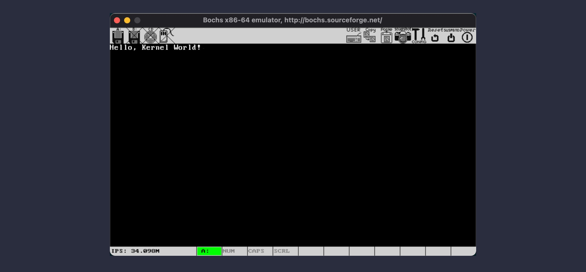

# Execute in bochs

## 编译 Hello, World

接着上一节的内容，为了能让 BIOS 执行我们的引导程序，首先，要把 boot.asm 编译成二进制版本。为此，我们可以执行：

```shell
nasm boot.asm -o boot.bin
```

如果一切顺利，在当前目录下，就会找到一个 512 字节大小的 boot.bin 文件。我们先把它留在这里，接下来要准备一个可以启动的 Bochs 环境。

## 为启动 Bochs 做准备

### 理解 Bochs 配置文件

和我们使用过的诸如 VMWare，VirtualBox 或者 Parallel Desktop 不同，Bochs 没有一个专门创建虚拟机的 GUI 向导，它的所有硬件配置，都是通过一个 .bochsrc 配置文件设置的。如果在 mac OS 上，你是通过 `brew` 命令安装的 Bochs，你可以查看：

```shell
/usr/local/Cellar/bochs/2.6.11/share/doc/bochs/bochsrc-sample.txt
```

这个文件里记录了 Bochs 支持的所有配置以及使用方法。或者，如果下载了源代码，在源代码的根目录里，也会有一份类似的文件。我们可以把它当作模板，配置一个最简单的“概念机”。当然，如果你打开上面这份文件，就会发现，里面连同注释和配置，内容非常多。如果现在你不想逐个去了解并设置它们，可以直接用我在 [GitHub 上分享的一个精简过的模板]()，把它在项目的根目录保存成 `.bochsrc` 就可以了。其中，和我们接下来的开发有关的，主要有以下几个配置：

```ini
floppya: 1_44=boot.img, status=inserted, write_protected=0
boot: floppy
```

这两个配置表示 Bochs 从过软盘启动，软盘镜像是当前目录下的 boot.img（别急，稍后我们就会制作这个文件）。

```ini
log: Output/bochsout.txt
debugger_log: Output/debugger.out
```

这两个配置分别用于指定 Bochs 的执行日志以及调试日志输出的文件。特别是调试日志，通过它，我们可以翻看过去的调试记录，去分析程序的问题，或者验证某个 CPU 的状态，而不用反复实际执行 Bochs。由于这个 Output 目录并不是默认的，因此，别忘了在当前目录下，新建一个 Output 目录，否则 Bochs 会启动失败的。

至此，Bochs 的配置文件部分就完成了。

### 创建软盘镜像并写入引导扇区

接下来，我们要创建一个软盘镜像作为 Bochs 的启动盘。Bochs 自带了一个叫做 `bximage` 的工具，直接在控制台执行，就会看到一个 TUI 向导：

```shell
========================================================================
                                bximage
  Disk Image Creation / Conversion / Resize and Commit Tool for Bochs
         $Id: bximage.cc 13481 2018-03-30 21:04:04Z vruppert $
========================================================================

1. Create new floppy or hard disk image
2. Convert hard disk image to other format (mode)
3. Resize hard disk image
4. Commit 'undoable' redolog to base image
5. Disk image info

0. Quit

Please choose one [0]
```

选 1，创建新的软盘镜像。然后，输入 fd 创建软盘镜像：

```shell
Create image

Do you want to create a floppy disk image or a hard disk image?
Please type hd or fd. [hd] fd
```

默认的软盘大小就是 1.44 MB 的，因此，直接回车继续就好了：

```shell
Choose the size of floppy disk image to create.
Please type 160k, 180k, 320k, 360k, 720k, 1.2M, 1.44M, 1.68M, 1.72M, or 2.88M.
 [1.44M]
```

接下来，Bochs 会提示我们输入镜像文件的名字，输入：boot.img。

```shell
What should be the name of the image?
[a.img] boot.img
```

这样，Bochs 就会给我们一个提示，如何把生成的镜像“插入到” Bochs 虚拟机里：

```shell
The following line should appear in your bochsrc:
  floppya: image="boot.img", status=inserted
```

这也是我们的配置文件里，关于 floppa 这行配置的由来。

### 写入引导扇区

还记得一开始我们编译生成的 boot.bin 么？现在，我们要把这个 512 字节的二进制镜像，写入到 boot.img 的第一个扇区，让它作为引导扇区。这样，Bochs 启动之后，就会执行我们的代码了。在终端里，转到我们的项目目录，执行下面的命令就好了：

```shell
dd if=boot.bin of=boot.img bs=512 count=1 conv=notrunc
```

## 启动 Bochs

至此，一切就都准备就绪了。现在直接在项目根目录执行 `bochs`，Bochs 就会读取我们的 .bochsrc 配置文件并启动。自检完成后，它会给我们提供一个 TUI 决定接下来的行为：

```shell
You can also start bochs with the -q option to skip these menus.

1. Restore factory default configuration
2. Read options from...
3. Edit options
4. Save options to...
5. Restore the Bochs state from...
6. Begin simulation
7. Quit now

Please choose one: [6]
```

默认是 6，也就是开始模拟 PC。接下来，如果 Bochs 成功开启了调试模式，CPU 就会自动进入调试状态，并停在命令行上等待我们输入指令：

```shell
Please choose one: [6]
00000000000i[      ] lt_dlhandle is 0x7f88af804460
00000000000i[PLUGIN] loaded plugin libbx_sdl2.so
00000000000i[      ] installing sdl2 module as the Bochs GUI
00000000000i[SDL2  ] maximum host resolution: x=3840 y=2160
00000000000i[      ] using log file Output/bochsout.txt
Next at t=0
(0) [0x0000fffffff0] f000:fff0 (unk. ctxt): jmpf 0xf000:e05b          ; ea5be000f0
<bochs:1>
```

## 第一个物理断点

还记得我们上一节说过的，BIOS 会把引导扇区的代码加载到物理地址 0x7C00 并执行么？为了验证这个过程，我们可以在 Bochs 命令行中输入 `pb 0x7C00`。这里，`pb` 是 Physical Break 的缩写，表示物理地址断点。完成后，输入 `c`，让 Bochs CPU 恢复执行：

```shell
<bochs:1> pb 0x7c00
<bochs:2> c
```

这时，Bochs 就会打开一个很复古的 GUI 界面，我们先不管它，重要的是，在终端，Bochs CPU 会停在我们指定的断点上：

```shell
<bochs:2> c
(0) Breakpoint 1, 0x0000000000007c00 in ?? ()
Next at t=4575306
(0) [0x000000007c00] 0000:7c00 (unk. ctxt): jmp .+60 (0x00007c3e)     ; eb3c
```

看到最后一行的输出了么？`0000:7c00` 正是我们说过的地址，这里是一条跳转指令。我们继续在调试窗口输入 `n`，表示单步执行一条 CPU 指令。然后，输入 `u 0x7c3e 0x7c6e`，这是 Bochs 调试器的反汇编命令，只要提供起始和结束地址，Bochs 就会提供这段地址的 CPU 指令了：

> 这里，0x7C3E 是我们根据 `n` 命令的返回结果选择的，大家自己实验的时候，要根据自己电脑的实际结果设置。当然，对于我们当前的场景来说，这个地址应该是固定的。

```shell
<bochs:3> n
Next at t=4575307
(0) [0x000000007c3e] 0000:7c3e (unk. ctxt): mov ax, cs              ; 8cc8
<bochs:4> u 0x7c3e 0x7c6e
0000000000007c3e: (                    ): mov ax, cs                ; 8cc8
0000000000007c40: (                    ): mov ds, ax                ; 8ed8
0000000000007c42: (                    ): mov es, ax                ; 8ec0
0000000000007c44: (                    ): mov ss, ax                ; 8ed0
0000000000007c46: (                    ): mov sp, 0x7c00            ; bc007c
```

通过反汇编的结果，不难发现，这部分正是 boot.asm 文件中开始的几条 CPU 指令，这证明，我们的代码已经开始被 CPU 执行了。接下来，在调试器中输入 `c`，让虚拟 CPU 恢复执行，我们就可以在刚才那个复古的 GUI 中，看到期望的结果了：



这时，按照设计，CPU 就会挂起在我们编写的 `jmp` 指令上，用不了多久，你的电脑风扇就会开始狂转 :) 这时，我们可以调试器中按 `Ctrl + C` 中断执行，然后执行 `exit` 命令关闭 Bochs 就好了。

## What's next

至此，我们就完成了一个内核版的 Hello, World。虽然它没有任何实质性功能，但它却为我们打开了一扇通往内核世界的大门，我们了解了如何从 BIOS 接管计算机控制权，如何调试内核的执行过程。这对于内核开发来说，都是极为重要的事情。

从下一节开始，我们就要正式开始构建内核了。打破 512 字节的限制，是我们要面对的第一个挑战。
