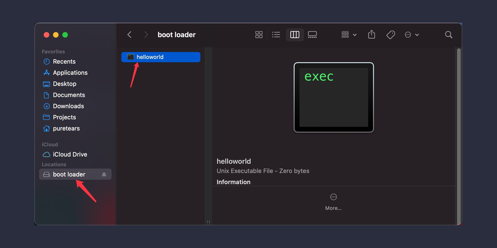

# Break the 512 bytes limit

[本节源代码](https://github.com/puretears/yuna/blob/master/Documentation/Chapter1/Execise03/boot.asm)

从 BIOS 接手了计算机控制权之后，我们要做的第一件事，就是突破引导扇区 512 字节的限制。这个尺寸对于操作系统内核来说，实在是太小了。稍后我们就会看到，别说内核了，就连一个内核的引导程序，512 字节都只是将将够用而已。怎么办呢？

一个最直接的想法，就是让这 512 字节的程序把另外一个更大的程序加载到内存里，并跳转到新程序中执行。这个过程，和 BIOS 把引导扇区加载到内存并把控制权交给我们是类似的。所以，接下来的问题就变成了：如何去加载这个所谓更大的程序呢？

## FAT12 文件系统

为了实现这个目标，我们得给这个软盘镜像安装一个文件系统。这样，才可以方便地向其中添加文件。而我们的引导扇区代码，必须能够识别这个文件系统，才能在其中找到要加载到内存的文件。

说到这，你可能会想了：等等，我们这连个内核的影子都还没看见呢，就要去搞文件系统了？这跑题的也太早了吧。其实，不用担心，并不是所有文件系统都像它听起来的那么复杂。在 Linux 0.1 发布的那个年代，文件系统看上去，也就是诸如字典这种数据结构这么简单，完全可以用 512 字节以内的代码实现读写。没错，我们选择的 FAT12 就是这样的一个文件系统。

具体要怎么做呢？

### 手工打造的 FAT12

其实，把我们的软盘镜像格式化成 FAT12 文件系统并不需要什么外界工具，我们是在代码里，手工“安排”出来的：

```asm
; boot.asm
org 0x7C00
BASE equ 0x7C00

jmp short label_start
nop

;------------- FAT12 data ---------------

;------------- End FAT12 data ---------------

label_start:
    mov ax, cs
    mov ds, ax
    mov es, ax
```

看到了把，这次我们的 boot.asm 是这个样子的，开始的语句变成了一个 `jmp` 和 `nop` 指令，用于跳过记录 FAT12 数据信息的部分，进而继续执行引导扇区里的代码，这两条指令，也是 FAT12 文件系统数据规格的一部分。而中间注释的部分，就是我们要手动构建 FAT12 文件系统的地方了。

### 理解 FAT12 的数据规格

就像刚才说的一样，FAT12 开始的三个字节，是一个 `jmp` 和一个 `nop`。接下来，我们用代码的形式，列出完整的 FAT12 头部：

```asm
jmp short label_start
nop

;------------- FAT12 data ---------------
BS_OEMName                  db 'YunaBoot'
BPB_BytesPerSector          dw 512
BPB_SectorsPerCluster       db 1
BPB_ResveredSectors         dw 1 ; The first sector is reserved
BPB_NumOfFATs               db 2 ; The number of FAT tables
BPB_RootDirectoryEntries    dw 224
BPB_TotalSectors            dw 2880
BPB_MediaDescriptor         db 0F0H
BPB_SectorsPerFAT           dw 9
BPB_SectorsPerTrack         dw 18
BPB_NumOfHeads              dw 2
BPB_HiddenSectors           dd 0
BPB_TotalSectors32          dd 0
BS_DrvNum                   db 0 ; Driver number of int 13H
BS_Reserved                 db 0
BS_BootSig                  db 029H
BS_VolID                    dd 0
BS_VolLabel                 db 'boot loader'
BS_FileSystem               db 'FAT12   '

;------------- End FAT12 data ---------------
```

其中，`db / dw / dd` 是 nasm 的命令，分别表示 字节 / 双字节 / 四字节。因此，从上面的代码中，我们就能知道每个字段的长度了，这个非常重要，大家自己写的时候务必要小心，尤其是字符串的部分，哪怕错一个字节（例如字符串少了一个空格），文件系统都无法正常工作。接下来，我们就逐个说一下这些字段的含义。

* **BS_OEMName**：可以理解为磁盘的生产商名称，既然是我们创建的镜像，当然就可以随意设置了，确保长度是 8 字节就好了；
* **BPB_BytesPerSector**：磁盘上每扇区的字节数，对 1.44 MB 软盘来说，当然就是 512 字节；

> 这里，`BS` 前缀是 Boot Sector 的缩写，而 `BPB` 则是 BIOS Parameter Block 的缩写，下同，就不再重复说明了。

* **BPB_SectorsPerCluster**：文件系统中每族（cluster）的扇区数，这个值只能是 1 / 2 / 4 / 8 / 16 / 32 / 64 / 128。所谓的族，可以理解为文件系统中的最小读写单元，因为并不是所有的文件系统都需要按物理扇区一次次的读写，因此有了这个概念。不过对于 FAT12 来说，这个值是 1，所以一个族就对应一个扇区；
* **BPB_ResveredSectors**：文件系统保留的扇区数。对 FAT12 来说，这个值是 1，因为引导扇区是保留的；
* **BPB_NumOfFATTables**：文件系统中，FAT的个数，至于什么是 FAT，我们稍后再说，现在只要知道，对于 FAT12 来说，这个值总是 2，其中一个是另外一个的拷贝就好了；
* **BPB_RootDirectoryEntries**：文件系统中，根目录项个数的最大值，所谓的根目录项，就是文件系统中用于记录文件属性信息的一个数据结构。要注意的是，这个值必须是 16 的倍数；
* **BPB_TotalSectors**：磁盘的扇区数，这个值为什么是 2880 呢？如果一个软件的容量按 1.44MB 计算的话，这个值应该是 1.44 x 1024 x 1024 / 512，也就是 2949 才对呀。实际上，这个 Bochs 自带的 bximage 工具的一个 bug 有关。当我们用 bximage 查看它生成的 boot.img 文件时，可以看到镜像信息是类似这样的：

```shell
# Execute bximage and enter 5
What is the name of the image?
[c.img] boot.img

disk image mode = 'flat'
hd_size: 1474560
geometry = 2/16/63 (1 MB)
```

看到吧，bximage 生成的软盘镜像，大小是 1474560 字节，并不是严格的 1.44MB，因此用这个值除以 512，就是 2880 了。

* **BPB_MediaDescriptor**：表示媒体描述符，大家理解成 0F0H 表示 1.44MB 软盘就好了；
* **BPB_SectorsPerFAT**：表示文件系统中，每个 FAT 占用的扇区数，这个值的计算方法我们稍后再说；
* **BPB_SectorsPerTrack**：表示磁盘每个磁道的扇区数。18 是 1.44MB 软盘的制造规格；
* **BPB_NumOfHeads**：表示磁盘的磁头个数，对于软驱来说，这个值是 2；
* **BPB_HiddenSectors** 和 **BPB_TotalSectors32** 在当前的设置下必须是 0，他们主要是为了对当时的 DOS 做兼容而提供的设置，现在忽略它们就好了；
* **BS_DrvNum**：表示驱动器编号，0 是软驱；
* **BS_Reserved**：就像它的名字一样，保留字段，必须是 0；
* **BS_BootSig**：这个值必须是 029H，表示在这个字段后面，还有三个表达文件系统的字段；
* **BS_VolID**：磁盘的序列号，这个是当年的硬件制造商才会使用的东西，我们设置成 0 就好了；
* **BS_VolLabel**：11 字节的磁盘卷标，长度固定，内容我们随意设置一下就好；
* **BS_FileSystem**：文件系统的类型，同样长度固定，因此 `FAT12` 后面还要跟上三个空格；

至此，一个手工打造的 FAT12 文件系统就完成了，怎么样，是不是比想象中简单得多？

## 测试文件读写

接下来，我们重新编译，并把结果写入 boot.img 的引导扇区：

```asm
nasm boot.asm -o boot.bin
dd if=boot.bin of=boot.img bs=512 count=1 conv=notrunc
```

执行下 Bochs，如果一切顺利，新的代码仍旧可以正常在屏幕上打印 Hello, Kernel World!。但这次，我们插入 Bochs 的软盘，已经是带有文件系统的了。如何确认这个事情呢？根据你使用的操作系统，我们有几种不同的做法。

### 和 Linux 兼容的方法

如果你使用的是 mac OS，我们可以借助 Docker，这样就和 Linux 上的方法一致了。先执行下面的命令启动一个容器：

```shell
docker run -it -v /Users/puretears/Projects/Yuna:/home/root --privileged boxue/base:1.1.0 bash
```

这里，我使用了泊学统一维护的 Linux 镜像，你可以换成任何一个你习惯的 Linux 发行版，重要的是，要把项目的根目录映射到容器里。这样，我们就可以在容器里挂载这个软盘镜像了：

```shell
cd /home/root
mount boot.img /media -t vfat -o loop
```

此时，如果一切正常，`/media` 应该就是我们的软盘根目录了，我们进入 `/media`，并在其中创建一个叫做 Helloworld 的文件：

```shell
cd /media
touch Helloworld
sync
```

> 一定要在 `touch` 之后执行 `sync`，否则文件可能会丢失。

然后，执行 `umount /media` 之后，再重新执行 `mount`，Helloworld 文件应该仍旧存在，这就可以确定，我们构建的 FAT12 文件系统已经可以正常工作了。

### mac OS 专有的方法

当然，在 mac OS 上，除了使用 Docker 之外，我们还有一种更简单的方法。直接在终端执行：

```shell
# In the project root directory
hdiutil attach ./boot.img
```

mac OS 就会自动识别 boot.img 的文件系统，并把它挂载到 Finder（在 Finder 里可以看到，磁盘的卷标，就是我们通过 `BS_VolLabel` 设置的内容）：



这样，就可以通过 Finder 直接读写软盘中的内容了。如果你之前使用了 Docker 的方法，现在应该能在 Finder 里看到我们之前创建的 Helloworld。这进一步确定了，我们的文件系统是可以正常工作的。

## What's next

有了这一节创建的文件系统，我们就可以打破 512 字节的限制了（当然，我们还受软盘大小的限制，不过一个好消息是，在我们正式把内核移植到硬盘之前，软盘的容量对于内核来说，都足够了）。我们可以单独编译内核并拷贝到软盘中，然后，让启动扇区的代码加载并跳转到内核执行。而这，就是我们下一节的内容。
