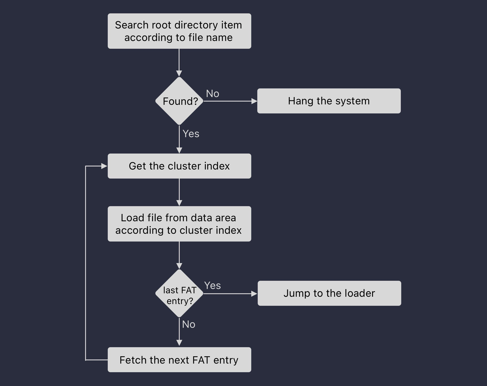

# Load the loader

[本节源代码](https://github.com/puretears/yuna/tree/master/Documentation/Chapter1/Execise04)

这一节，我们来落实之前提出的让引导扇区代码去加载另外一端程序的想法。这个实验需要两个文件：

* 一个仍旧是引导扇区的代码 boot.asm；
* 另一个则是被加载程序的代码，我们叫它叫做 loader.asm;

## loader.asm

先从简单的开始，我们另外写一段程序，模拟引导扇区要加载的内容，为了便于识别，我们写成这样：

```asm
    org 0x10000

xor ax, ax
xor bx, bx
xor cx, cx
xor dx, dx
```

这里，透露了两个信息，一个是这个程序的基地址 `0x10000`，也就是引导扇区的代码将要把这部分代码加载到 1MB 开始的内存地址。另一个是我们模拟出来的特征代码，如果我们最后可以在 Bochs 调试器里看到这 4 条设置寄存器的指令，就表示整个逻辑走通了。所以，写完这些代码执行，执行 `nasm loader.asm -o loader.bin`，把编译出来的结果按照上一节的方法拷贝到 boot.img 文件里就好了。。

## boot.asm

接下来，就是重头戏了，我们要在引导扇区的代码里，找到 loader.bin，并把它加载到内存里。这就需要我们自己写一段基于 FAT12 文件系统查找文件的代码。这就需要我们进一步了解一下 FAT12 文件系统除了引导扇区中的头部数据结构之外，整个磁盘的数据结构了。把它用一张图表示，就是这样的：

```shell
┌────────────────────────────┐
│                            │
│          Data Area         │
│                            │
├────────────────────────────┤
│                            │
│     Root Directory Area    │
│                            │
├────────────────────────────┤
│             FAT2           │
├────────────────────────────┤
│             FAT1           │
├────────────────────────────┤
│         Boot sector        │
└────────────────────────────┘
```

### File Allocation Table

可以看到，紧挨着引导扇区之后的，就是两个 FAT，它们的全名是 File Allocation Table。所谓文件分配表，记录的就是一个文件究竟被存在磁盘的哪些扇区上。上一节我们说过，FAT12 有两个文件分配表，它们是完全相同的，实际使用的时候，我们只用其中一个就好了。

**对于 FAT12 来说，文件分配表中的每项占用 1.5 字节**，也就是 12-bit，这也是 FAT12 这个名字的由来。至于 FAT 的用法，我们稍后再说。

那么，每个 FAT 自身应该占据多大空间呢？也就是上一节，引导扇区中 `BPB_SectorsPerFAT` 的值是怎么算出来的呢？一个简单的办法，就是计算为了让 FAT 表达一个软盘的所有扇区，需要的记录数：

* 首选，一个软盘共有 1.44 x 1024 x 1024 = 1509949.44 字节
* 其次，这些字节约需要 2950 扇区支持；
* 第三，也就是说，我们在 FAT 中要有 2950 条记录表达这些扇区。按每条记录两字节计算，共需 4425 字节；

因此，**在 FAT12 文件系统中，每个 FAT 表需要占用 9 扇区**。

关于 FAT，我们暂时就先说这么多，因为要继续的话，我们还需要更多的知识铺垫。

### Root Directory Area

在两个 FATs 后面，是一块叫做 Root Directory Area 的区域。要注意不要被这个名字迷惑了，这个 Root Directory 和我们直觉里的文件根目录不是一回事儿。它是一个获取软盘上所有文件的入口，例如：文件的名字，存储的第一个扇区等等。根目录区的每条记录，都是一个 32 字节的数据结构，我们着重说一些用得到的内容：

* 首先，开始的 8 字节，是文件名，并且，文件名最多也只能 8 字节。例如，对于 loader.bin 来说，这部分的内容就是 'l', 'o', 'a', 'd', 'e', 'r', 0, 0；
* 其次，之后的 3 字节，是扩展名，在我们的例子中，就是字符串 bin；
* 第三，接下来的若干字节，就是文件的读写属性、修改时间等信息，这对我们来说，都是没必要了解的部分，所以就跳过了；
* 第四，从第 26 字节开始的两个字节，是一个重要的信息，即文件开始的族号（对于 FAT12 来说，也就是扇区号）。它定义了文件在软盘上保存时，存储的第一个扇区的位置；
* 最后的四字节，表示文件的大小；

### FAT 格式的二进制分析

有了这些知识，就足够我们在 FAT12 文件系统中查找文件了。不过在正式写代码之前，我们先用静态分析的方法走一遍这个过程。这里，我使用的工具是 [radare2](https://rada.re/n/radare2.html)，你可以使用任何一个你熟悉的二进制编辑器。

直接打开 boot.img，按照之前的说法，根目录区是查找文件的入口，因此，我们跳过引导扇区和两个 FAT，也就是 19 扇区，直接查看根目录表的内容：

```shell
[0x00000000]> px 128 @ 19*512
- offset -   0 1  2 3  4 5  6 7  8 9  A B  C D  E F  0123456789ABCDEF
0x00002600  412e 0066 0073 0065 0076 000f 00da 6500  A..f.s.e.v....e.
0x00002610  6e00 7400 7300 6400 0000 0000 ffff ffff  n.t.s.d.........
0x00002620  4653 4556 454e 7e31 2020 2012 0081 2986  FSEVEN~1   ...).
0x00002630  2151 2151 0000 2986 2151 0200 0000 0000  !Q!Q..).!Q......
0x00002640  4c4f 4144 4552 2020 4249 4e20 1846 b89c  LOADER  BIN .F..
0x00002650  1f51 2151 0000 1086 2151 0c00 0800 0000  .Q!Q....!Q......
0x00002660  e52e 005f 006c 006f 0061 000f 0093 6400  ..._.l.o.a....d.
0x00002670  6500 7200 2e00 6200 6900 0000 6e00 0000  e.r...b.i...n...
```

> `px 128 @ 19*512` 是 radare2 的命令，表示从 0x2600 位置显示 96 个字节。

可以看到，我们之前拷贝的 loader.bin 是根目录区域中的第三条记录（也就是从偏移 0x2640 开始的记录）。接下来，在第三条记录的偏移 0x1A 的位置，连续的两个字节的值是 0x0c。刚才我们说过，这个值表示文件开始的族号，但应该如何使用呢？

#### 在 FAT 表中查找记录

实际上，我们要用这个值做两件事情。**一件，是用这个值在 FAT 中查找记录**。为此，我们先来看看 FAT 的内容，根据之前说过的，FAT 位于文件偏移 0x200 的位置：

```shell
[0x00000000]> px 32 @ 0x200
- offset -   0 1  2 3  4 5  6 7  8 9  A B  C D  E F  0123456789ABCDEF
0x00000200  f0ff ffff ffff ffff ff00 0000 0000 0000  ................
0x00000210  0000 ff0f 0000 0000 0000 0000 0000 0000  ................
```

它的第 0x0C 条记录的偏移是 12 x 1.5，也就是 18 字节。因此，从 0x212 位置，**按照 little-endian 的方式，读出两字节的值，是 0x0FFF，然后取低 12-bit 的值，就是 0xFFF**。在 FAT 里，0xFFF 表示这是文件的最后一个族，也就是说，当前，我们的 loader.bin 一个族就放下了。

如果这个值不是 0xFFF 呢？除了一些我们无需关心的特殊值之外：

* 它要么是 0，表示这个扇区当前没有内容，可以写入数据；
* 要么，它就指向文件的下一个族，我们就用这个值，继续在 FAT 里查找对应的表项，直到找到 0xFFF 结束标记，也就找到了保存文件的所有扇区。稍后在写代码的时候，我们就会看到这个过程；

#### 在软盘数据区读取内容

除了用根目录区读取的索引值查找 FAT 之外，它的另外一个作用，就是在软盘的数据区读取文件。但要注意的是，**我们不能直接用这个索引在数据区加载内容**。因为，FAT 中，第 0 项和第 1 项是系统保留的，因此，为了在 FAT 中正确查找到记录，这个索引值是加了 2 的。因此，在数据区索引扇区的时候，我们要把这个值减回来。也就是对于 0xC 来说，对应的是数据区开始的第 10 个扇区。

```shell
[0x00000000]> px 16 @ (1+9+9+14+10)*512
- offset -   0 1  2 3  4 5  6 7  8 9  A B  C D  E F  0123456789ABCDEF
0x00005600  31c0 31db 31c9 31d2 0000 0000 0000 0000  1.1.1.1.........
```

上面的代码里，`1+9+9+14+10` 是什么意思呢？

* 1 是引导扇区；
* 9+9 是两个 FAT 占用的扇区；
* 14 是根目录区占用的扇区（224 * 32 / 512 = 14）；
* 10 是文件在数据区中的偏移；

因此，`(1+9+9+14+10)*512` 就是 loader.bin 文件在软盘中的位置了。把这个位置反汇编，得到的结果是这样的：

```shell
[0000:0000]> pd 4 @ (1+9+9+14+10)*512
            0000:5600      31c0           xor ax, ax
            0000:5602      31db           xor bx, bx
            0000:5604      31c9           xor cx, cx
            0000:5606      31d2           xor dx, dx
```

> 为了让 radare2 反汇编 16 位代码，我们可以在启动的时候执行 `r2 -b 16 boot.img`。

可以看到，这就是我们写在 loader.asm 文件中的指令，只不过在我的电脑上，0x31 表示的 `xor` 指令默认使用 32 位寄存器而已。当处理器处于实模式时，就使用 16 位寄存器了。

## What's next

最后，我们用一张图总结这个二进制分析的过程：



理解了这个过程之后，下一节，我们用代码实现从 FAT 加载文件的逻辑。
