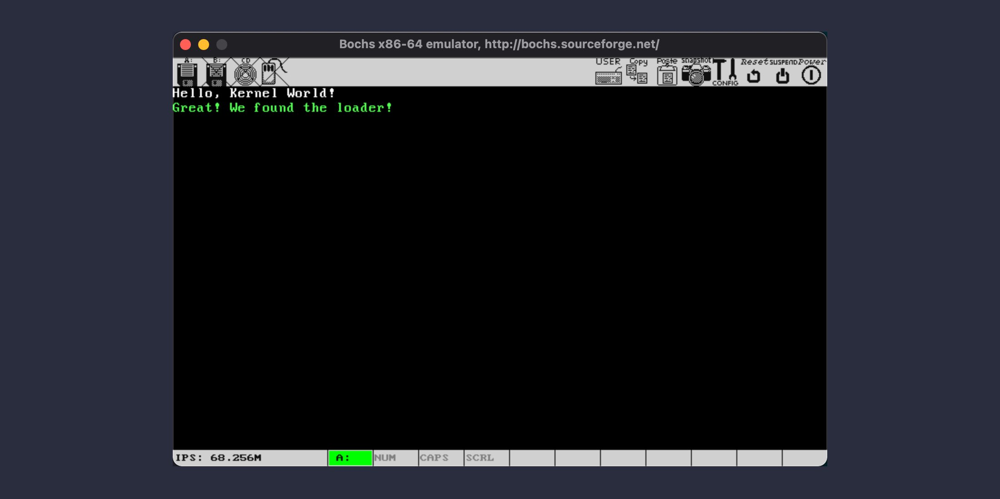

# Load the loader

[本节源代码](https://github.com/puretears/yuna/tree/master/Documentation/Chapter1/Execise05)

有了前面的一番准备工作，这一节，我们终于可以开始写代码在软盘镜像中加载程序了。

## 一些有用的常量和变量

开始之前，我们先定义一些帮助我们定位地址的常量：

```asm
LOADER_BASE             equ 0x1000
LOADER_OFFSET           equ 0x0
FAT1_SECTOR_INDEX       equ 1
ROOT_DIR_SECTORS        equ 14
ROOT_DIR_SECTOR_INDEX   equ 19
```

这里：

* `LOADER_BASE / LOADER_OFFSET` 表示我们要把 loader.bin 加载到的目标地址，即：0x1000:0；
* `FAT1_SECTOR_INDEX` 是第一个 FAT 的扇区偏移，它紧挨着引导扇区，因此是 1；
* `ROOT_DIR_SECTORS` 是根目录区的总扇区数，我们设定的根目录最大记录数是 224，因此这个值是 224 x 32 / 512，也就是 14 个；
* `ROOT_DIR_SECTOR_INDEX` 是根目录区的起始扇区偏移，它紧挨着第二个 FAT，所以是 1 + 9 + 9，也就是 19；

另外，在之前定义的 `booting_message` 后面，我们还要定义一些程序中用到的变量：

```asm
booting_message         db 'Hello, Kernel World!'
unread_root_dir_sectors dw ROOT_DIR_SECTORS
root_dir_sector_offset  dw ROOT_DIR_SECTOR_INDEX
loader_not_found_prompt db 'ERROR: No loader found!'
loader_found_prompt     db 'Great! We found the loader!'
loader_name             db 'LOADER  BIN', 0
times 510 - ($ - $$)    db 0
dw 0xAA55
```

其中：

* `unread_root_dir_sectors` 表示还未查找的根目录扇区；
* `root_dir_sector_offset` 表示当前要读取的根目录区扇区偏移；
* `loader_not_found_prompt` 和 `loader_found_prompt` 分别表示没找到 loader.bin 和找到 loader.bin 时给用户的提示；

## 读取扇区的帮助函数

接下来，我们要定义一个方便读取扇区的函数，因为每次要设置 BIOS `int 13H` 中断的寄存器参数，是一件很麻烦的事情。因此，在 `booting_message` 上面，我们添加这样一段代码：

```asm
; ========================== Helpers
    ; AX - The starting sector number
    ; CL - How many sectors will be read
    ; ES:BX - The buffer address
read_sectors:
    push bp
    mov bp, sp
    ; The following two instructs are a tip that save cl in a word
    sub sp, 2
    mov [bp - 2], cl
    push dx
    push bx

    mov bl, [BPB_SectorsPerTrack]
    div bl

    inc ah ; ah - reminder, ah + 1 - the starting sector number in a track
    mov cl, ah

    mov dh, al ; al - quotient
    and dh, 1  ; dh - disk header number
    mov dl, [BS_DrvNum]

    shr al, 1
    mov ch, al ; ch - cylinder number

    pop bx ; bx - bufer address
_continue_reading:
    mov ah, 2
    mov al, byte [bp - 2]
    int 13H
    jc _continue_reading

    pop dx
    add sp, 2
    pop bp
    ret
```

这里：

* `AX` 中存放的是我们要读取第几个扇区；
* `CL` 中存放的是要从 `AX` 开始，连续读多少扇区；
* `ES:BX` 指向的是存放读取数据的缓冲区；

如果你不想关注它的细节，就可以跳过这一部分直接到“从检查文件开始了”。这里值得说一下的，主要有四点。

第一个是在汇编代码中我的一个习惯，对于可以直接被调用的位置，我会采用名称加下划线的方式定义，它们可以理解为是“公开函数”，例如这里的 `read_sectors`。而对于控制程序执行过程做出的标记位置，我会在名称前面加上一个 `_`，提示我这是一个内部标记，不可直接调用，例如，表示继续读取扇区的 `_continue_reading`。这样，整理代码的时候，会比较清楚。在接下来项目中所有的汇编代码里，我都会保持相同的命名方式。

第二个是关于在函数栈中存放数据并保持字节对齐的技巧：

```asm
push bp
mov bp, sp
; The following two instructs are a tip that save cl in a word
sub sp, 2
mov [bp - 2], cl
push bx
```

为什么保存 `bp` 和 `bx` 的时候都直接使用了 `push`，而保存 `cl` 时却使用了 `mov` 呢？就像注释里写的那样，这是为了内存对齐，当我们要在栈中保存一个字节的时候，就可以像这样，用手工移动 `sp` 的方式腾出栈空间，然后再用 `bp` 去模拟压栈的行为。

第三个是如何把 `AX` 表示的扇区索引变成 BIOS 使用的 CHS 地址。BIOS 是无法直接理解诸如“读取第 100 个扇区”这种表达方式的。BIOS 对磁盘的定位，是通过一种叫做 CHS 寻址的方式完成的。我们先用 `AX / BPB_SectorsPerTrack`：

* 得到的余数加 1 就是该扇区在磁道内的偏移（也就是 CHS 中的 S，Sector）；
* 得到的商和 1 做与运算，得到的结果是用哪个磁头（也就是 CHS 中的 H，Head）；
* 得到的商除以 2，得到的结果就是磁盘的柱面号，也可以理解为磁道号 (也就是 CHS 中的 C，Cylinder)；

最后，是把转换好的地址存放到 `int 13H` 指定的寄存器中读取硬盘，其中：

* `AH = 02`，这是 `13H` 功能号，02 表示读取磁盘扇区；
* `AL`，表示读入的扇区，也就是我们通过 `CL` 传入的参数；
* `CH`，对软盘来说，就是磁道号；
* `CL`，对软盘来说，就是扇区号（注意，这个扇区号是从 1 开始的，而不是 0）；
* `DH`，使用的磁头号；
* `DL`，驱动器号；
* `ES:BX`，数据缓冲区地址；

准备好这些寄存器内容之后，调用 `int 13H` 中断就可以把磁盘数据加载到内存了，由于这个加载过程有可能需要连续读取磁盘，因此，只要 EFLAGS 寄存器的 CF 标志是置位状态，我们就得一直读下去，直到这个标志为 0。Emm... 是不是看着就很麻烦，这也是为什么我们要把这个过程封装成函数的原因。不过好在现如今，我们只是知道这个逻辑就好了，直接用 `read_sectors` 则简单了很多。
 
## 从检查文件开始

OK，说完了 `read_sectors`，我们就可以从在根目录区查找文件名开始了。这部分代码，紧接着之前在屏幕上显示 `booting_message` 的部分。

首先，如果根目录区域所有扇区都加载完了，我们仍旧没有找到 loader.bin，那说明这个文件根本就不存在，我们就打印一条错误提示：

```asm
_search_in_root_directory:
    cmp word [unread_root_dir_sectors], 0
    jz _loader_not_found
```

否则，就加载一个扇区的根目录区域到内存，并递减扇区计数。从下面的代码可以看到，根目录区域被我们加载到了 0x8000。当然，这个地址并不一定是 0x8000，我们只要选择一个没人用的“空地”也就好了。

```asm
dec word [unread_root_dir_sectors]

; Load a sector of root directory into memory for file searching
xor ax, ax
mov es, ax
mov bx, 08000H
mov ax, [root_dir_sector_offset]
mov cl, 1
call read_sectors
```

此时，我们使用的内存布局是这样的：

```asm
┌────────────────────────────┐
│                            │
│        Root Directory      │
├────────────────────────────┤0x8000  
│                            │
│           Unused           │
├────────────────────────────┤0x7E00  
│                            │
│         Boot sector        │
└────────────────────────────┘0x7C00
```

加载完成后，我们把 `si` 和 `di` 指向源、目的字符串地址：

```asm
; Now, es:bx points to the root directory area
mov si, loader_name
mov di, 08000H
cld
```

并在每一个根目录表项中，对比文件名是否为 `LOADER   BIN`：

```asm
mov dx, 10H ; Number of root directory item per sector (512 / 32)

_search_loader_bin:
    cmp dx, 0
    jz _go_to_next_sector_of_root_directory

    dec dx
    mov cx, 11

_compare_file_name:
    cmp cx, 0
    jz _loader_found
    dec cx
    lodsb
    cmp al, byte [es:di]
    jz _continue_comparing
    jmp _go_to_next_entry

_continue_comparing:
    inc di
    jmp _compare_file_name

_go_to_next_entry:
    and di, 0FFE0H
    add di, 20H
    mov si, loader_name
    jmp _search_loader_bin
```

由于每个根目录表项占用 32 字节，因此一个扇区的根目录中共有 0x10 条记录。如果找到了，就跳转到 `_loader_found` 标记的位置。否则，如果一个扇区的根目录表都检查完了也没找到，就跳转到 `_go_to_next_sector_of_root_directory`：

```asm
_go_to_next_sector_of_root_directory:
    inc word [root_dir_sector_offset]
    jmp _search_in_root_directory
```

在这里，我们把根目录区的扇区偏移加 1，继续加载下一个扇区到内存。然后，就像我们在一开始看到的，如果根目录区所有扇区都检查完了也没找到，就跳转到 `_loader_not_found`：

```asm
_search_in_root_directory:
    cmp word [unread_root_dir_sectors], 0
    jz _loader_not_found
```

最后，无论是找到了，还是没找到，我们都在屏幕上显示一串文字，表示当前加载工作的一个阶段性结束：

```asm
_loader_not_found:
    mov ax, 1301H
    mov bx, 008CH
    mov dx, 0100H
    mov cx, 23
    push ax
    mov ax, ds
    mov es, ax
    pop ax
    mov bp, loader_not_found_prompt
    int 10H
    jmp $ ; Hang the system

_loader_found:
    mov ax, 1301H
    mov bx, 000AH
    mov dx, 0100H
    mov cx, 27
    push ax
    mov ax, ds
    mov es, ax
    pop ax
    mov bp, loader_found_prompt
    int 10H
    jmp $ ; Hang the system
```

现在，就可以按照之前的方法，重新编译 boot.asm，并重新写到 boot.img 了。这个操作并不会影响 boot.img 里的文件，因为我们只是重写了 boot.img 引导扇区的部分，并没有修改它的 FAT，根目录区以及数据区。然后，重新运行，如果一切顺利，就会看到下面这样的截图了：



## 静态调试汇编指令的方法

那么，如果不顺利呢？那一定是你在编码的过程中，忘记了其中的某个细节。当然，你可以用之前我们介绍过的 Bochs 虚拟 CPU 单步调试执行，看看到底在什么位置出了错误。这里，再给大家介绍一种静态分析的方法。用到的工具，仍旧是之前提到的 radare2。在控制台，依次执行：

* `r2 -b 16 -A boot.img`，表示用 16 位模式，打开并分析 boot.img；
* 然后，在 radare2 的控制台里执行：`agf > ascii_graph.txt`。`agf` 是 analysis graph function 的缩写，把分析的结果，重定向到 ascii_graph.txt 里。这个文件是一份用文本图形表示的分析结果，它比较占地方，这里列出一部分给大家感受一下：


[这里](https://github.com/puretears/yuna/blob/master/Output/ascii_graph.txt)有一份完整的分析结果，大家可以点过去看下，或者自己在电脑上生成一份。这份结果可以帮助我们更好地对汇编代码进行局部分析，找到其中的问题。

> 当函数比较复杂之后，可能生成的文本图形就不太便于分析了。这时，我们可以执行 `agfd @ 0x3e > graph.dot`，生成一份 dot 文件。然后，用一个 Graphviz 工具或[在线服务](http://www.webgraphviz.com/)打开分析就好了。

## What's next

以上，就是这一节的内容。找到了 loader.bin 文件的记录。下一节，我们就寻着这条记录，把 loader.bin 加载到内存并跳转过去执行。
