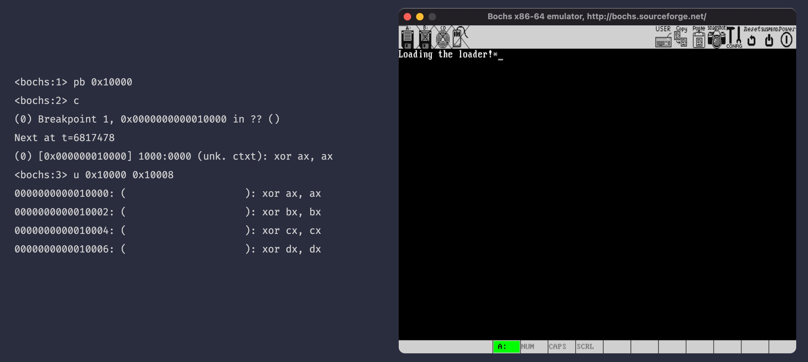

# Jump to the loader

[本节源代码](https://github.com/puretears/yuna/tree/master/Documentation/Chapter1/Execise06)

上一节，我们在 FAT12 文件系统中找到了 loader.bin 的记录。这一节，我们根据这条记录，把 loader.bin 从磁盘加载到内存，并把计算机的控制权交给它。

首先，在根目录区域找到 loader.bin 的根目录项之后，我们从它的 0x1A 偏移处，读出 FAT 索引：

```asm
_loader_found:
    mov ax, ROOT_DIR_SECTORS
    and di, 0FFE0H
    ; Make di points to the head address of current root directory entry
    add di, 01AH
    mov cx, [es:di]
```

其次，根据这个索引，算出对文件数据的第一个扇区的位置：

```asm
push cx ; Push the cluster index
add cx, ax
add cx, 17 ; 1 + 9 + 9 + 14 + CX - 2
```

之前我们说过，FAT 中的记录，由于 FAT 的第 0 和第 1 项是系统保留的，因此，FAT 中记录的值会比实际的值大 2。因此，当计算文件数据所在扇区的时候，我们要在 `1 + 9 + 9 + 14 + CX` 之后，再减 2。

第三，我们就可以根据这个扇区的位置，把文件加载到缓冲区了，这里，为了方便观察，每加载一个扇区，我们就在屏幕上打印一个星号：

```asm
    mov ax, LOADER_BASE
    mov es, ax
    mov bx, LOADER_OFFSET
    mov ax, cx

_continue_loading_loader:
    push ax
    push bx
    mov ah, 0EH
    mov al, '*'
    mov bl, 0AH
    int 10H
    pop bx
    pop ax

    ; AX = sector index
    ; ES:BX = buffer address
    mov cl, 1
    call read_sectors
```

第四，根据第一个读到的 FAT 记录，假设有一个读取下一条 FAT 记录的函数 `get_fat_entry`。我们比较一下调用它之后的返回值，如果是 0xFFF，就表示这已经是文件的最后一个数据扇区了，loader.bin 已经加载完毕：

```asm
pop ax; AX = cluster number
call get_fat_entry

cmp ax, 0FFFH
jz _finish_loading_loader
```

否则，就根据新的 FAT 记录值，继续加载文件的数据扇区：

```asm
push ax
add ax, ROOT_DIR_SECTORS
add ax, 17
add bx, [BPB_BytesPerSector]
jmp _continue_loading_loader
```

最后，当所有数据扇区都加载完了，我们就通过一行 `jmp`，把计算机的控制权交给 loader.bin：

```asm
_finish_loading_loader:
    jmp LOADER_BASE:LOADER_OFFSET
```

这样，加载 loader.bin 的主体逻辑就完成了。还剩下一个收尾工作，就是根据上一个 FAT 记录查找下一个 FAT 记录的函数：`get_fat_entry`。

## get_fat_entry

之所以要把这个函数从加载 loader.bin 的过程中单独拿出来，是因为用汇编实现它还稍微有点点复杂。先来看它的框架部分：

```asm
; AX - FAT index
get_fat_entry:
    push bp
    mov bp, sp
    ; A temporary variable that can be used as [bp - 2]
    ; is_odd
    sub sp, 2
    push es
    push bx

    ; ...

    ; Restore the stack and return
    pop bx
    pop es
    add sp, 2
    pop bp
    ret
```

`get_fat_entry` 通过 `AX` 寄存器接收参数，表示 FAT 的上一个记录，也通过 `AX` 返回值，表示根据参数在 FAT 中读到的下一条 FAT 记录。

> 无论是汇编语言里自己写函数，还是写给供高级语言调用的函数，通过 `AX` 返回值都是一种约定俗成的做法。编译器也会对高级语言编写的程序采用类似的策略。

所谓这个框架部分，就是简单的通过栈保存并恢复函数调用过程中使用的寄存器。通常，除了 `AX` 之外，我们在调用函数的时候，不改变任何寄存器的内容。另外，这里用了一个之前说过的技巧，通过手工把 `sp` 减 2 的方式，开辟了一个临时变量。就像注释说明的一样，这个临时变量用于判断 FAT 记录的首地址是奇数还是偶数。

接下来，就是实现的部分了，我们先把 `AX * 3 / 2`，如果余数是 0，则表示首地址是偶数，否则就是奇数。如果是奇数，就把 `[bp-2]` 设置成 1：

```asm
    mov word [bp - 2], 0
    mov bx, 3
    mul bx
    mov bx, 2
    div bx
    cmp dx, 0 ; DX - reminder
    jz _even_index
    mov word [bp - 2], 1
_even_index:
```

然后，我们算一下 FAT 记录所在的起始扇区号。这次，由于 FAT 记录是 1.5 字节一条，因此，可能会存在一条记录跨扇区的情况，所以，我们得到了其实扇区号之后，要连续读两个字节。注意，这里，我们把 FAT 又加载到了 0x8000 地址处，覆盖了之前加载的根目录区域。这样做并没有什么问题，现在现在我们已经不需要根目录区了：

```asm
_even_index:
    xor dx, dx
    mov bx, [BPB_BytesPerSector]
    div bx

    add ax, FAT1_SECTOR_INDEX
    mov bx, 8000H
    mov cl, 2
    call read_sectors
```

FAT 读入内存之后，记得加上之前计算扇区数时留下的余数，这是扇区内的偏移。然后读出 2 字节的内容，如果之前判断 FAT 记录的首地址是偶数，那么直接取它的低 12-bit 就是下一个数据区扇区的偏移。如果是奇数，我们就要取它的高 12 字节的内容，因此在代码里，把 `AX` 向右移动 4 bit 就好了：

```asm
    add bx, dx
    mov ax, [es:bx] ; The FAT entry
    cmp word [bp - 2], 1
    jnz _even_index1
    shr ax, 4
_even_index1:
    and ax, 0FFFH
```

这样，`get_fat_entry` 就也实现完了。

## 其它的小调整

最后，我们说一些 boot.asm 的小调整。为了能让 boot.asm 的代码编译后在 512 字节以内，我们去掉了上一节找到 loader.bin 后的提示，并且，把 `boot_message` 改成了 `Loading the loader!`。

> 这里，别忘了修改显示 `boot_message` 时的字符串长度。

现在，重新编译一下 boot.asm 并写入 boot.img，执行 Bochs，这次，在 Bochs 控制台里，我们打个断点：

```shell
pb 0x10000
```

如果一切顺利，Bochs 就会在软盘中找到我们的 loader.bin，把它加载到 0x10000 处执行，然后 Bochs 就会被断下来，此时，执行 `u 0x10000 0x10008` 反汇编 8 字节的数据，应该能看到下面的结果：



无论是左边的汇编指令，还是右边窗口中的 `*` 都表示，当前，我们的想法已经被成功执行了。

## 整理项目目录

这一节最后，我们整理下项目目录。为了能够自动化编译和写入 boot.img 的过程。我们在项目根目录创建了两个脚本：

* [build.sh](https://github.com/puretears/yuna/blob/master/build.sh)：用于编译项目文件，并启动 docker，每次我们只要在终端执行这个脚本就好了；
* [cp.sh](https://github.com/puretears/yuna/blob/master/cp.sh)：这是在容器内执行的脚本，用于挂载磁盘镜像以及拷贝文件；

至于构建过程中生成的所有文件，我们都统一放到 Output 目录里。至于这两个脚本的内容，都是之前我们在终端手工执行的命令，大家自己去看看源代码就好，这里就不解释了。

## What's next

至此，我们就彻底摆脱开引导扇区 512 字节的限制了，在 loader.asm 里，我们不必再关心代码的长度。接下来，就像它的名字一样，我们来真正实现 loader 应该做的事情：为操作系统进入保护模式做必要的准备，并且加载内核。
