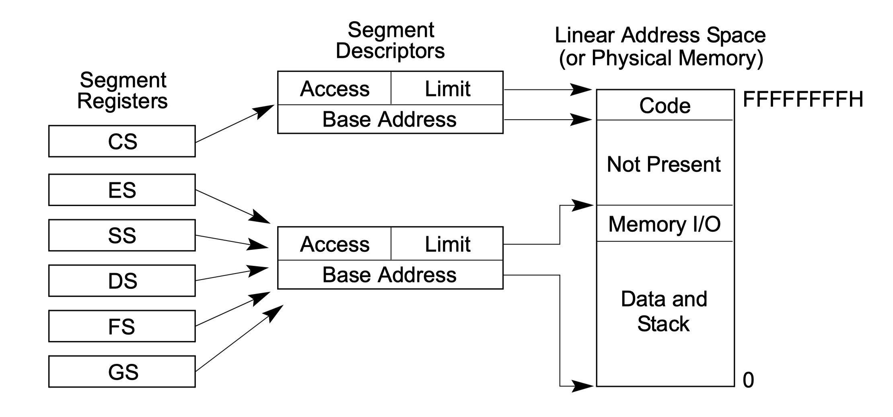
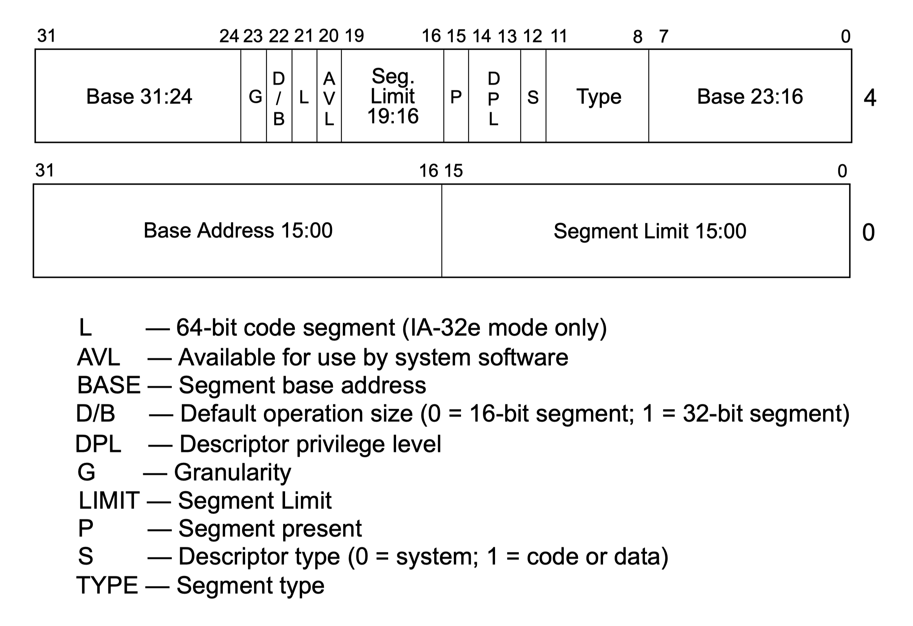

# Break the 1MB limit

[本节源代码](https://github.com/puretears/yuna/tree/master/Documentation/Chapter1/Execise06)

在 loader 里，没有了 512 字节的束缚，我们就可以安心开发需要的功能了。作为内核的“二级推进器”，loader 的主要工作可以分成两大类：

* 一类是把内核送达目标地址空间，这和之前加载 loader.bin 到内存是类似的；
* 另一类则是准备好必要的硬件信息数据供内核使用；

这一节，我们就先从第一类任务开始。那么：内核的目标地址空间是什么呢？

在 CPU 还处于实模式的时候，CPU只能使用 20 位地址总线。因此，总共可以寻址的空间只有 2^20 字节，也就是 1 MB。包括 BIOS，显示设备，系统 IO，以及应用程序需要的内存，都需要安排在这 1 MB 里。这也导致了这块不大的内存里，被零零散散的拆成了各种用途的地址段。

显然，这种“坑坑洼洼”的地址空间并不适合存放内核。一方面，内核的视野不应该只有这区区 1 MB 地址空间；另一方面，最好能把内核安放在一大片连续且无人使用的地址段，避开这个充满了历史问题的 1 MB，以免在内核启动时，发生一些不可预知的错误。

因此，一个理想的位置，就是 1 MB 以及以上的地址空间。这部分空间默认在实模式阶段是访问不到的，因此，也就不会有任何预留的系统地址段，它就像一大片未开发的平原，用来存放内核刚好。

## Big Real Mode

那么，接下来的问题就变成了：我们该如何访问 1 MB 地址空间呢？简单来说，这个过程分成下面几步：

* 首先，把 CPU 从实模式切换到保护模式；
* 其次，在保护模式下，让 CPU 的某个段寄存器可以寻址 1 MB 以上的内存，我们的例子中，使用了 `fs` 寄存器，这是个没有什么汇编指令会默认使用的寄存器，使用它比较安全和方便；
* 最后，让 CPU 回到实模式；

这时，**只要我们不修改 `fs` 的值**，在实模式就可以访问 1 MB 以上的地址空间了。此时的实模式，叫做 Big Real Mode。于是，接下来的问题就变成了下面两个：

* 如何从实模式切换到保护模式呢？
* 在保护模式下如何设置 `fs` 可访问的地址空间呢？

## 切换到保护模式

### 打开 A20 地址线

为了把 CPU 从实模式切换到保护模式，第一个要做的事情，就是打开 CPU 的所有地址线，让地址总线从 20 位变成 32 位。这样，就有了 2^32，也就是 4 GB 内存的寻址能力。

为此，在 loader.asm 里，我们添加了下面的代码：

```asm
push ax
in al, 92H
or al, 00000010b
out 92H, al
pop ax
```

其实，就是写入 92H 端口的 bit1 就好了。

### Segment Descriptor

接下来，为了启用保护模式，我们要为 CPU 准备一些数据结构。一个叫做 segment descriptor，它用来描述一段地址空间的功能、访问权限、地址范围等信息；另一个，叫做 segment selector，可以把它看作是 segment descriptor 的索引，在保护模式下，把这个 selector 加载到段寄存器，如果访问合法，就可以用这个段寄存器访问与之对应的 segment descriptor 描述的内存了。把这个关系用一张图表示，就是这样的：



我们用 segment descriptor 划分不同用途的地址空间，再把对应的 segment selector 装载到段寄存器去访问。看到这，你应该会想，segment descriptor 究竟是什么样的呢？它是一个 4 字节的复杂数据结构：



我们挑一些当前会用到的部分来说：

* 第一个字节的 bit0-15，和第四个字节的 bit0-3 拼起来，是地址段的长度；
* 第二个字节的 bit0-15，第三个字节的 bit0-7，和第四个字节的 bit8-15拼起来，是地址段的起始地址；

> 你可能会感觉很奇怪，为什么要把一个完整的数值拆开存在不同的地方呢？坦白讲，具体原因我也不知道，姑且认为是设计芯片的时候，我们不知道的历史原因吧 :)

除了长度和起始地址之外，segment descriptor 里还有一些零零散散的 bit：

* **Type** 表示地址段的类型，别看它有 4 个 bit，通常我们只会设置两个值，对于数据段来说，设置成 2 表示可读写。对于代码段来说，设置成 0xA，表示成可读可执行；
* **S** 表示描述符自身的类型，当前我们要设置成 1，表示用于描述代码或数据的描述符；
* **DPL** 表示地址段的访问权限，从最高权限 0 到最低权限 3。对内核来说，通常设置成 0；
* **P** 表示地址段是否存在，通常设置成 1；
* **AVL** 软件保留位，我们用不到，设置成 0 就好；
* **L** 这是在 64 位模式才使用的标志，当前设置成 0；
* **D/B** 16 位内存段设置成 0，32 位内存段设置成 1；
* **G** 和段描述符中 limit 的计量方法有关，我们设置成 1 就好；

说到这，你可能已经发现了，尽管 segnment descriptor 的结构很复杂，但对于我们来说，有很大一部分值都是固定的，我们对着 loader.asm 中实际的代码来看一下：

```asm
[SECTION gdt]
label_gdt:   dd 0, 0
code32_desc: dd 0x0000FFFF, 0x00CF9A00
data32_desc: dd 0x0000FFFF, 0x00CF9200
```

这里，我们定义了三个 segment descriptor：

* 第一个保持全 0 是 x86 CPU 的约定；
* 第二个用于描述 32 位代码段，它的 limit 拼出来是 0xFFFFF，base 拼出来是 0x00000000；剩下的 `C`，`9` 和 `A` 我们按位拆开看下：

```shell
      ┌──────◇───────◇─────◇───────┐
      │  G   │  D/B  │  L  │  AVL  │
      └──────◇───────◇─────◇───────┘
 0xC     1       1      0      0

      ┌──────◇─────────────◇───────┐
      │  P   │     DPL     │   S   │
      └──────◇─────────────◇───────┘
 0x9     1         0 0         1

      ┌────────────────────────────┐
      │            Type            │
      └────────────────────────────┘
 0xA     1         0 1         0
```

* 第三个用于描述 32 位数据段，可以看到，它和 32 位代码段唯一不同的地方就是 Type，它的值是 2，表示可读写数据段，其余所有值和代码段都是一样的，我们就不再重复了；

最后，再多说一下 limit，由于我们把 `G` 设置成了 1，它表示以 4KB 为单位计算 limit，于是 0xFFFFF 就表示一共有 2^20 个 4KB 地址段可供访问，也就是之前我们说过的 4GB 地址空间了。

看到这，关于 segment descriptor 的知识铺垫也就差不多了。其实，我们完全没必要记住这个数据结构的细节，因为对我们来说，32 位代码段和数据段的描述符几乎就是上面这样固定的，它们的特征值就是 `0xCF9A00` 和 `0xCF9200`。

### Segment Selector

接下来，我们来看 segment selector。它是 segment descriptor 的索引，只是这个索引也是带有结构的：

```shell
  15───────────────3─◇─2─◇─1───0
  │        Index     │TI │ RPL │
  └──────────────────◇───◇─────┘
```

其中：

* **RPL** 是 segment selector 的 bit 0-1，表示索引的特权级，这个值只有比 segment descriptor 中的 DPL 高，才可以索引对应的 segment descriptor；
* **TI** 是 segent selector 的 bit 2，表示索引用在哪个表里。CPU 有两个存放 segment descriptor 的表，一个叫做 Global Descriptor Table（GDT），另一个叫做 Local Descriptor Table（LDT）。我们刚才在 loader.asm 中看到的，就是 GDT，LDT 暂时还不用到，所以就不管了。因此，这里，要把 TI 标志置 0；
* **Index** 才是真正在 GDT 或 LDT 中的索引，按照约定，GDT 中的第一个元素是保留项。因此，`Index` 部分的最小值是 1；

因此，对内核来说，第一个可用的 selector 的值应该是 `b0000000000001000`，也就是十六进制的 `0x08`。类似地，第二个可用的 selector 是 `0x10`。看到这两个值的规律了么？`0x08` 和 `0x10`，它们的差值正好是一个 segment descriptor 的大小。也就是说，每一个 segment descriptor 和它对应的 selector 可以用下面这样的方式定义出来：

```asm
[SECTION gdt]
label_gdt: dd 0, 0
code32_desc: dd 0x0000FFFF, 0x00CF9A00
data32_desc: dd 0x0000FFFF, 0x00CF9200

code32_sel equ code32_desc - label_gdt
data32_sel equ data32_desc - label_gdt
```

### GDTR

现在，定义好了 segment descriptor 和 selector，接下来，怎么让 CPU 用上这一套数数据结构呢？实际上，CPU 有一个叫做 GDTR 的寄存器，它保存了 GDT 的首地址和长度，为了设置它，我们要像这样准备一个数据结构：

```asm
  47────────────────────────16◇15───────────0
  │    32-bit base address    │     Limit   │
  └───────────────────────────◇─────────────┘
```

这是个 6 字节的数据。前面的两个字节表示 GDT 的长度，后面的 4 字节表示 GDT 的首地址。最终，我们的 GDT 部分，看起来就是这样的：

```asm
[SECTION gdt]
label_gdt: dd 0, 0
code32_desc: dd 0x0000FFFF, 0x00CF9A00
data32_desc: dd 0x0000FFFF, 0x00CF9200

gdt_len equ $ - label_gdt
gdt_ptr dw gdt_len - 1
        dd label_gdt

code32_sel equ code32_desc - label_gdt
data32_sel equ data32_desc - label_gdt
```

其中，`gdt_ptr` 标记的 6 个字节，就是 GDTR 寄存器需要的数据。

### 从保护模式到 Big Real Mode

至此，我们就做好了一切准备。现在是时候把 CPU 切换到保护模式了。这个过程是这样的：

* 首先，打开 A20 地址线，并关闭可屏蔽中断，接下来的一系列操作，关乎 CPU 的工作方式，我们不能被打断：

```asm
push ax
in al, 92H
or al, 00000010b
out 92H, al
pop ax

sti
```

* 其次，用 `lgdt` 汇编指令加载 GDT。这里之所以要加上 0x66 前缀是因为当前是 16 位代码段，为了让 `lgdt` 加载 32 位数据，需要用这个前缀给 CPU 做一个指令标记：

```asm
; Setup CR0 and enable protected mode
db 0x66
lgdt [gdt_ptr]
```

* 第三，通过 CPU 的 `CR0` 寄存器，开启保护模式。只要写入 `CR0` 的 bit0 就好了：

```swift
mov eax, cr0
or eax, 1
mov cr0, eax
```

现在，CPU 就工作在保护模式了。我们给 `fs` 寄存器装配上 `data32_sel`，让它能访问 1MB 以上的地址空间：

```asm
mov ax, data32_sel
mov fs, ax
```

* 最后，让 CPU 重新回到实模式，并打开中断：

```asm
mov eax, cr0
and al, 11111110b
mov cr0, eax

sti
```

这样，CPU 就处于 Big Real Mode 的状态了。我们的工作也可以告一个段落，稍事休息了。因此，在 `sti` 之后，我们可以插一个 `jmp $` 指令把 CPU 挂起来。

> 这里要特别说明下，回到实模式之后，不要再对 `fs` 进行任何修改，否则，`fs` 就会失去从保护模式继承来的内存访问能力了。

### 在调试器里验证

然后，在 Bochs 的调试器里，我们实际观察下刚才提到的这些概念。思路就是 Bochs 启动后，我们反汇编出 `mov fs, ax` 这条指令的地址，然后把 CPU 断在这里，单步执行后，观察 CPU 段寄存器的变化。实际执行后，结果是类似这样的：

```shell
(0) [0x00000001009a] 1000:000000000000009a (unk. ctxt): mov fs, ax                ; 8ee0
<bochs:8> n
Next at t=6826280
(0) [0x00000001009c] 1000:000000000000009c (unk. ctxt): mov eax, cr0              ; 0f20c0
<bochs:9> sreg
es:0x1000, dh=0x00009301, dl=0x0000ffff, valid=1
	Data segment, base=0x00010000, limit=0x0000ffff, Read/Write, Accessed
cs:0x1000, dh=0x00009301, dl=0x0000ffff, valid=1
	Data segment, base=0x00010000, limit=0x0000ffff, Read/Write, Accessed
ss:0x0000, dh=0x00009300, dl=0x0000ffff, valid=7
	Data segment, base=0x00000000, limit=0x0000ffff, Read/Write, Accessed
ds:0x1000, dh=0x00009301, dl=0x0000ffff, valid=3
	Data segment, base=0x00010000, limit=0x0000ffff, Read/Write, Accessed
fs:0x0010, dh=0x00cf9300, dl=0x0000ffff, valid=1
	Data segment, base=0x00000000, limit=0xffffffff, Read/Write, Accessed
gs:0x0000, dh=0x00009300, dl=0x0000ffff, valid=1
	Data segment, base=0x00000000, limit=0x0000ffff, Read/Write, Accessed
ldtr:0x0000, dh=0x00008200, dl=0x0000ffff, valid=1
tr:0x0000, dh=0x00008b00, dl=0x0000ffff, valid=1
gdtr:base=0x0000000000010040, limit=0x17
idtr:base=0x0000000000000000, limit=0x3ff
```

可以看到，给 `fs` 赋值之后，它的 limit 已经变成了 0xFFFFFFFF，表示此时它已经可以寻址 4GB 的地址空间。并且，`gdtr` 的基地址是 0x10040，这就是 `label_gdt` 的地址，limit 是 0x17 是 23，因为我们在 GDT 中定义了三个表项，每个 8 字节，一共是 24 字节，GDT 对 limit 的要求是 GDT 的字节数减 1。

## 关于平坦内存模式

在结束这一节的内容之前，我们再回顾下 GDT 中的代码段和数据段。可以看到，它们的基地址都是 0x00000000，limit 都是 0xFFFFF。也就是说，它们表达的地址空间是完全重叠的。只是，当使用 `code32_sel` 时，这个 4GB 的地址空间就是可执行的；使用 `data32_sel` 时，这个 4GB 空间就是可写的。再换句话说，我们通过这样的设置，其实是变向屏蔽了 CPU 的内存分段机制，每一段都是完整的 4GB 物理内存空间，这种内存访问模式，叫做 flat mode，也就是平坦内存模式。在平坦模式下，我们可以直接依靠“段内偏移”来直接寻址，不考虑内存分页的前提下，我们之前在 IDE 里见过的诸如 0xXXXXXXXX 这样的地址，其实，就是 4GB 空间内的某个偏移。我们现如今使用的 Windows / Linux 等操作系统，也都使用了这种平坦模式。

## What's next

这一节，为了突破实模式下 1MB 地址空间的束缚，我们让 CPU 到保护模式走了一遭，给 `fs` 寄存器添加了额外的地址空间访问能力。下一节，我们就借用这个特性，把操作系统内核加载到目标地址。
