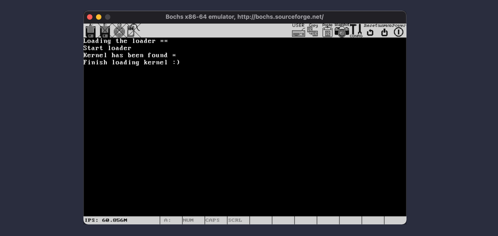

# Load the kernel

基于上一节的成果，我们要利用 `fs` 的地址空间访问能力，把内核加载到目标地址空间。这个过程和之前我们加载 loader.bin 有很多类似的地方。因此，对源代码的结果，我们做了一些调整：

* 首先，创建了一个内核替身，kernel.asm：

```asm
    org 0x100000
[SECTION .s32]
[BITS 32]
xor eax, eax
xor ebx, ebx
xor ecx, ecx
xor edx, edx
jmp $
```

它就是一个以 1MB 地址空间为起始地址的 32 位汇编代码片段，我们暂且把它当成内核看待。

* 其次，对于 FAT12 文件头的部分，我们从 boot.asm 和 loader.asm 中提取出来，变成了 fat12.inc。这样，只要 `%include "fat12.inc"` 就可以包含这个文件的内容了；

* 第三，对于读取扇区的 `read_sector` 和读取 FAT 项的 `get_fat_entry` 方法，由于加载 loader.bin 和 kernel.bin 的时候都会用到，我们把这两个方法提取在了 s16lib.inc 里；

做了这些改变之后，在 build.sh 里，我们添加了一段编译“内核”的命令：

```shell
echo "Compiling kernel.asm ..."
nasm kernel.asm -o Output/kernel.bin
```

最后，在 cp.sh 里，我们把 kernel.bin 也拷贝进软盘镜像：

```shell
#!/bin/bash

mount Output/boot.img /media -t vfat -o loop
cp Output/loader.bin /media
cp Output/kernel.bin /media
sync
umount /media
```

至此，各种前期的准备工作就完成了。接下来，就是加载内核了。

## 两段式加载内核

之前，从磁盘读取文件，我们一直用的都是 BIOS 的 `int 13H`。这个 API 使用 `ES:BP` 作为缓存地址，显然是无法指向 1MB 以上地址空间的。因此，我们需要先把内核加载到 1MB 以内的一个临时地址，从手动从这个临时地址把内核搬到 1MB 以上的地址。由于 1MB 地址空间有限，这个搬运的操作，我们得按扇区来，每读取一个扇区，就搬运一次。

这部分代码，紧接着上一节回到 Big Real Mode，并打开中断之后。在根目录表中查找 kernel.bin 的部分，和查找 loader.bin 是相同的，我们就略过了。

在 loader.asm 的 `_kernel_found:` 标记处，我们读取内核文件的一个扇区到 `TMP_KERNEL_BASE:TMP_KERNEL_OFFSET`。然后，像下面这样，把这个扇区搬到 1MB 开始的地址空间：

```asm
; ------ Move kernel.bin from 0x7E00 to 0x100000, sector by sector ------
    push cx
    push ds
    push eax
    push esi
    push edi
    
    mov cx, 200H
    mov edi, dword [current_kernel_offset]

    mov ax, TMP_KERNEL_BASE
    mov ds, ax
    mov esi, TMP_KERNEL_OFFSET
_move_kernel:
    mov al, byte [ds:esi]
    mov byte [fs:edi], al
    inc esi
    inc edi
    loop _move_kernel

    mov ax, 0x1000 ; Loader is based on 0x10000
    mov ds, ax
    mov dword [current_kernel_offset], edi

    pop edi
    pop esi
    pop eax
    pop ds
    pop cx
; ------ End Move kernel.bin from 0x7E00 to 0x100000, sector by sector ------
```

这里，我们使用了一个叫做 `current_kernel_offset` 的变量保存加载内核的偏移，它的初始值是 0x100000：

```asm
KERNEL_OFFSET equ 0x100000
current_kernel_offset dd KERNEL_OFFSET
```

这样，在搬运的时候，`[fs:edi]` 就从 1MB 地址开始了。在上面这段代码里，另外一个值得说一下的地方，就是 `ds` 的变化。在拷贝内核文件的时候，`ds` 的段地址是 `TMP_KERNEL_BASE`，也就是 `int 13H` 写入的基地址。每当搬运完一个扇区，要更新 `current_kernel_offset` 值的时候，我们要把 `ds` 重新指向 loader.bin 的基地址，也就是 0x1000，否则，`mov dword [current_kernel_offset], edi` 指令中使用的地址偏移就错了。

搬运完一个扇区之后，接下来的操作，就又和加载 loader.bin 是类似的了。我们用当前扇区号在 FAT 中查找下一个扇区号，读取这个扇区，继续搬运，搬运完继续在 FAT 中查找下一条记录，直到结果是 0xFFF 为止。大家直接去看代码就好，我们就不重复了。

搬运完所有的内核数据扇区，我们就又来到一个新的里程碑了。在 loader.asm 里，这个里程碑是通过 `_finish_loading_kernel:` 标记的，在这里，我们在屏幕上显示一行信息，然后还是用 `jmp $` 把系统挂起来。

执行一下，如果一切顺利，就能看到类似下面的结果了：



## What's next

搬运完内核，loader.bin 的工作就完成一半了。从下一节开始，我们要继续在 loader.bin 里，为内核准备好各种必要的系统信息。
