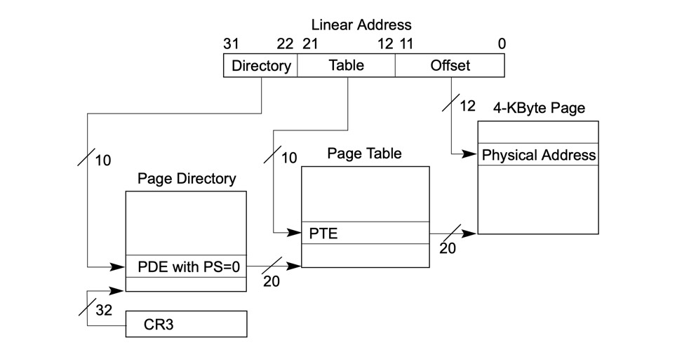
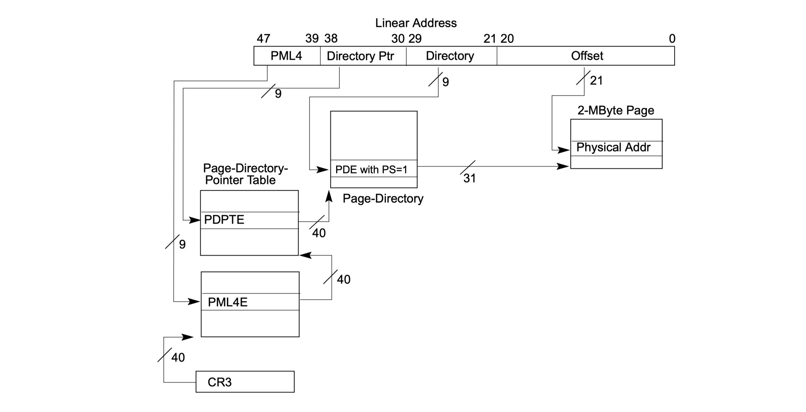

# Paging

在正式开发内核的各种功能之前，我们说说 CPU 的内存分页管理机制。

## 为什么要有内存分页机制呢

在有分页管理之前，字节是 CPU 管理物理内存的基本单位。但这种直接把形如 `0x10000` 这样的地址对应到物理内存，会带来一些问题。例如，如果我们把 `0x10000` 分配给了程序 1，这个地址就被程序 1 独占了，我们当然不希望这个地址被其它进程修改。于是，在操作系统看来，就必须为每个进程分配完全不同的地址空间，这就导致了能“同时”执行的进程数量完全受制于物理内存的大小。想想现如今动辄就需要上 G 内存的进程来说，这种内存管理方案显然是不能接受的。

那实际情况是什么样的呢？

```shell
                                                                            Physical Address  
                                                                             ┌─────────────┐  
                                                 ┌─────────────┐             │             │  
                                                 │             │             │             │  
┌─────────────┐                                  │             ├──────┐      │             │  
│             │                                  │             │      │      │             │  
│  process1   ├──────┐                           │             │      │      ├─────────────┤  
│             │      │       ┌───────────┐       │             │      └──────▶  address1   │  
└─────────────┘      │       │           │       │             │             ├─────────────┤  
                     ├──────▶│    VA     ├──────▶│  Paging     │             │             │  
                     │       │           │       │             │             │             │  
┌─────────────┐      │       └───────────┘       │  Mechanism  ├──────┐      │             │  
│             │      │                           │             │      │      │             │  
│  process2   ├──────┘                           │             │      │      │             │  
│             │                                  │             │      │      ├─────────────┤  
└─────────────┘                                  └─────────────┘      └──────▶  address2   │  
                                                                             ├─────────────┤  
                                                                             │             │  
                                                                             │             │  
                                                                             │             │  
                                                                             └─────────────┘  
```

就像上面图中表达的，不同的进程，是共享同一个**地址空间**的，每个进程里，都有可以访问形如 `0x100000` 这样的地址。我们管这样的地址叫做 **VA（Virtual Address）**，也就是虚拟地址，因为它们并不直接对应的物理存储。然后，在 CPU 里，有一部分管理单元用于把同一个 VA 按某种既定的逻辑映射到实际的物理内存地址，也就是 **PA（Physical Address）**。这里，所谓某种既定的逻辑，指的就是**内存分页（Paging）**。

> 如果你去翻翻 Intel SDM，还会看到一个叫做**线性地址（Linear Address）**的概念。为了不把事情搞复杂，我们把它理解为就是虚拟地址的别名就好了，本质上它们是一回事儿。

这样一来，对于操作系统内核来说，就可以让所有的进程逻辑上都使用同一个地址空间，例如，32 位模式下，就是 `0x00000000 - 0xFFFFFFFF`。进程对于系统有多少可用物理内存并没有感知，他总是认为自己可以使用地址总线所包含的所有内存。然后，由分页机制，按实际使用需要，把不同进程的同一个虚拟地址映射到不同的物理内存。这种方式，不仅进程模型实现起来更加简单，硬件利用率也提高了很多。

那究竟什么是“页”呢？简单来说，就是一块大小固定的内存，CPU 以这个大小为单位，管理所有的物理内存。页最小值是 4KB，最大可以是 1GB。不同的页大小，决定了 CPU 使用的不同分页模式。

## 32 位保护模式下的内存分页

我们从 32 位模式使用的 4KB 内存页的分页机制说起。在这种模式下，一个虚拟地址从低到高，被分成了三段：

```shell
31──────────────22◇21───────────12◇11─────────────────────0
│ Page Directory  │   Page Table  │       offset          │
└─────────────────◇───────────────◇───────────────────────┘
```

举个例子：`0x00000010`，看下这个地址的三个部分：

* Page Directory 的部分，是最高的 10-bit，它的值是 `b0000000000`，也就是 0；
* Page Table 的部分，是中间的 10-bit，不难发现，它的值也是 0；
* Offset 的部分，是最低的 12-bit，它的值是 2；

### Page Directory

这里提到的 Page Directory 和 Page Table，是 CPU 在执行内存分页的时候要使用的数据结构。**这个结构由软件的开发者进行定义**，并加载到 CPU 特定的寄存器中。

我们从最顶端的 Page Directory 说起，它是一个数组，数组中的每一项都是一个 32 位的结构：

```shell
31                              12   11  10  9   8   7   6   5   4   3    2   1     0  
┌──────────────────────────────────◇───◇───◇───◇───◇───◇───◇───◇───◇───◇───◇──────◇───┐
│    Page Table Address            │ 0 │ 0 │ 0 │ 0 │ 0 │ 0 │ A │ 0 │ 0 │ 0 │ R/W  │ 1 │
└──────────────────────────────────◇───◇───◇───◇───◇───◇───◇───◇───◇───◇───◇──────◇───┘
```

这里，我们刻意忽略掉了一些暂时无需关心的 bit，把它们默认设置成了 0 或者 1，等大家了解了分页机制之后，有需要的时候，我们再来专门说明。而对于其中标记了文字的：

* **R/W**：置位表示内存页可读写，否则只读；
* **A**：置位表示内存页已经访问过，否则表示没访问过；
* **bit 12 - 31**：这是这条 Page Directory 记录所对应的页表的基地址，对于 4KB 的内存分页来说，这个地址的低 12 位一定都是 0，因此，每一个页目录项中只记录了页表地址的高 20 位；

我们管每一个这样的结构，叫做一个 Page Directory Element，也就是 PDE。那么刚才说的 Page Directory，就是一个 PDE 的数组。这个数组的基地址，要写在 CPU 的 `cr3` 寄存器里。并且，有了这个基地址之后，每个虚拟地址的高 10 位就用作这个数组的偏移，在其中找到对应的 PDE，也就获取了 Page Table 的基地址。

### Page Table

那么，所谓的 Page Table 又是什么呢？其实，它也是一个数组，数组中的每一项，叫做 PTE（Page Table Element），用于表示每一个物理内存页的属性。对于 4KB 的内存页来说，它的 PTE 是这样的：

```shell
31                              12   11  10  9   8   7   6   5   4   3   2    1     0  
┌──────────────────────────────────◇───◇───◇───◇───◇───◇───◇───◇───◇───◇───◇──────◇───┐
│          4KB Page Frame          │ 0 │ 0 │ 0 │ 0 │ 0 │ 0 │ A │ 0 │ 0 │ 0 │ R/W  │ 1 │
└──────────────────────────────────◇───◇───◇───◇───◇───◇───◇───◇───◇───◇───◇──────◇───┘
```

看到了吧，和 PDE 几乎是一摸一样的。有了 Page Table 之后，一个虚拟地址的中间 10 bits，就用于 Page Table 的索引，这样，就可以得到一个确定的 PTE，通过这个 PTE，就可以得到一个物理内存页的地址。

```shell
┌────────────────┐ 4KB base address
│                │
│                │
├────────────────┤
│    Offset      │
├────────────────┤
│                │
│                │
│                │
└────────────────┘
```

有了物理内存页的地址之后，由于内存页的大小是 4KB，我们需要 12 bits 来寻址其中的每一个字节。而这，正好是虚拟地址中最低 12 位的作用。

理解了这个整个过程之后，我们把 CPU 的内存分页机制用一张图总结，就是这样的：



也就是说，在 4KB 分页模式下：

* 整个内存寻址的起始是 Page Directory，这个数组的地址存储在 CPU 的 `cr3` 寄存器里；
* 一个线性地址的高 10 bits，用于在 Page Directory 中找到对应的元素，这个元素中存储的是 Page Table 的地址，也就是说，系统中一共可以有 2^10 个 Page Table；
* 一个线性地址的中间 10 bits，用于在 Page Table 中找到对应的元素，这个元素中存储的是一个物理内存页的地址，也就是说，一个 Page Table 中，可以定位到 2^10 个物理内存页；
* 一个线性地址的最低 12 bits，用于在最终的到的物理内存页中，定位具体的字节；

### 是时候看看 CR3 寄存器了

最后，我们来看看 `cr3` 寄存器的格式：

```shell
31                               12 11    0  
┌──────────────────────────────────◇──────┐
│     Page Directory Address       │   0  │
└──────────────────────────────────◇──────┘
```

当然，我们仍旧做了一定程度的简化，当前，只有 `cr3` 寄存器的 bit 12-31 对我们是有用的，它表示页目录的基地址。显然，这个地址一定是 4KB 边界对齐的。

理解了整个过程之后，现在我们应该就能明白为什么所有进程都可以共享同一个地址空间了。只要每个进程拥有一套不同的页目录和页表，同一个虚拟地址就可以映射到不同的物理内存，而不会造成冲突了。

## IA-32e 模式下的内存分页

了解了 32 位的内存分页之后，我们来看 IA-32e 模式下的内存分页。虽然我们管 IA-32e 叫做 64 位，但现如今实际可使用的虚拟地址只有 48 位。这 48 位虚拟地址会映射到 52 位物理地址。也就是说，64 位模式下，理论上可寻址内存的大小是 2^52，也就是 4PB 内存。而同时可寻址内存，是 2^48，也就是 256TB。

### Cononical Address

既然虚拟地址只能用 48 位，那 64 位中剩余的位该怎么办呢？对此，Intel 做出了一个约定：**虚拟地址中的 bit 48-63，必须和 bit 47 保持一致**。否则，会导致 CPU 发生异常错误。我们管满足这种约定的地址，叫做 **Cononical Address**。也就是说，IA-32e 模式下，实际可以使用的内存地址范围是这样的：

* 0x00000000,00000000 - 0x00007FFF,FFFFFFFF；
* 0xFFFF8000,00000000 - 0xFFFFFFFF,FFFFFFFF；

### 4 级页表结构

了解了地址方面的知识之后，我们来看 IA-32e 使用的分页模型，和 32 位模式下的三段内存分页模型是一样的，只不过因为地址空间扩展到了 64 位，IA-32e 使用的是 **4 级页表**，每个**物理内存页的大小是 2MB**。我们先来看下地址的分段方法：

```shell
63       48  47         39 38                 30 29             21 20                  0
┌───────────◇─────────────◇─────────────────────◇─────────────────◇────────────────────┐
│           │    PML4     │  Directory Pointer  │    Directory    │          0         │
└───────────◇─────────────◇─────────────────────◇─────────────────◇────────────────────┘
```

就像刚才我们说过的，64 位的线性地址中，只有 48 位是可用的。至于这个分段结构中的 PML4 / Directory Pointer / Directory 具体是什么，我们一会儿再说。

> 要说一下的是，我们这里使用的 4 级页表只是 IA-32e 模式支持的分页模型的一种。其中，相关 bit 的设置，也是根据实际使用需要进行了约束，为的是找到一种正确的用法让我们可以开发内核就好了。至于 IA-32e 支持的多种不同分页方式，大家感兴趣可以查看 Intel SDM 手册，我们就不逐一列举了。

### 从 CR3 说起

这次，我们从分页机制的源头，也就是 `cr3` 寄存器说起。在 IA-32e 模式下，`cr3` 从 32 位扩展成了 64 位，它的格式是这样的：

```shell
63         52 51                           12 11                 0
┌────────────◇───────────────────────────────◇───────────────────┐
│     0      │     PML4 physical address     │         0         │
└────────────◇───────────────────────────────◇───────────────────┘
```

其实没比 32 位复杂多少，对不？

### PML4

`cr3` 被扩展到 64 位之后，它的 12-51 bits 变成了一个叫做 PML4 的地址。这个 PML4 也是一个数组，功能和 32 位模式下的 Page Directory 类似。数组中的每一项的结构，是这样的：

```shell
63                   52 51                       12 11    6  5   4   3   2    1     0  
┌──────────────────────◇───────────────────────────◇───────◇───◇───◇───◇───◇──────◇───┐
│           0          │ Directory pointer address │   0   │ A │ 0 │ 0 │ 0 │ R/W  │ 1 │
└──────────────────────◇───────────────────────────◇───────◇───◇───◇───◇───◇──────◇───┘
```

其中：

* `R/W` 和 `A` 的作用，和 32 位模式下 PDE 的含义是相同的；
* 12-51 bits，是另外一个叫做 Directory pointer 数组的物理地址，根据上面这个结构不难理解，这个地址，也是在 4KB 地址对齐的；
* 52-63 bits 是保留位，必须为 0；

### Directory pointer

那 Dictionary Pointer 数组中的元素又是什么样的呢？其实，和 PML4 中的元素几乎是相同的：

```shell
63             52 51                   12 11     8  7    6   5   4   3    2     1     0  
┌────────────────◇───────────────────────◇────────◇────◇───◇───◇───◇───◇─────◇──────◇───┐
│        0       │   Directory address   │    0   │ PS │ 0 │ A │ 0 │ 0 │  0  │ R/W  │ 1 │
└────────────────◇───────────────────────◇────────◇────◇───◇───◇───◇───◇─────◇──────◇───┘
```

有区别的地方：

* 一个是 bit-7，`PS` 是 Page Size 的意思，这个 bit 决定了 4 级页表模式下，物理内存页的大小，如果置位，内存页的大小就是 1GB。但之前说过，我们使用的内存页大小是 2MB，因此，这位应该是 0；
* 另一个就是 12 - 51 bits，这部分变成了页目录的地址；

### Directory

接下来，我们就继续看下页目录中元素的结构。其实，和 Directory pointer 中的元素是一样的：

```shell
63             52 51                   12 11     8  7    6   5   4   3    2     1     0  
┌────────────────◇───────────────────────◇────────◇────◇───◇───◇───◇───◇─────◇──────◇───┐
│        0       │   Page address        │    0   │ PS │ 0 │ A │ 0 │ 0 │  0  │ R/W  │ 1 │
└────────────────◇───────────────────────◇────────◇────◇───◇───◇───◇───◇─────◇──────◇───┘
```

和 Directory pointer 中的元素不同的是：

* 这次，**`PS` 必须置位**，表示使用 2MB 大小的物理内存页；
* 进而，12-51 bits 变成了物理内存页的起始地址。然后，线性地址中的最后 21 位，就变成了从这个起始地址开始的偏移，由于 2MB 正好需要 21 bits 来索引；

说到这里，IA-32e 使用的 PML4 分页模型，就基本上说完了。我们还是用一张图来总结下：



其中：

* 整个寻址过程的开始，还是在 `cr3` 寄存器，它保存了 PML4 数组的地址；
* PML4 在线性地址中，一共有 9 bits 用来索引，所以最多有 2^9 个 PML4 表项；
* Directory pointer 在线性地址中，也有 9 bits 索引，所以，一个 PML4 记录，最多指向 2^9 个 Directory pointer 数组；
* Directory 在线性地址中，还是有 9 bits 索引，所以，一个 Directory 记录，最多可以指向 2^9 个 2MB 大小的物理内存页；
* 线性地址的最后 21 bits，用来在之前定位到的 2MB 物理内存上，指定偏移；

## 理解 loader 中的临时页表

理解了整个过程之后，终于到了看代码环节了。刚才说了那么多理论，分页的过程是如何对应到代码的呢？先来看我们手工构建的临时页表：

```asm
; -------------- Temporary Page Table --------------
mov dword [0x90000], 0x91003  ; PML4
mov dword [0x90800], 0x91003  ; PML4

mov dword [0x91000], 0x92003  ; PDPT

mov dword [0x92000], 0x000083 ; PD
mov dword [0x92008], 0x200083
mov dword [0x92010], 0x400083
mov dword [0x92018], 0x600083
mov dword [0x92020], 0x800083
mov dword [0x92028], 0xa00083
; ------------- End Temporary Page Table ------------
```

就像注释说明的一样，地址 `0x90000` 是 PML4 的首地址，当前，它有两个表项，分别用于对应 cononical address 的低地址和高地址，这两个地址对应的 PDPT 是一样的，都是 `0x91003`。按照刚才我们对 PML4 元素格式的分析，它表示一个可写的内存页，这个内存页的地址是 `0x91000`，或者写成 64 位就是 `0x0000000000091000`，为了方便，我们就省略掉高位的 0 了。

接下来，在 `0x91000` 这个地址上，我们应该写的，就是 Directory pointer 的地址，这个值是 `0x92003`，不难理解，他表示 Directory 的地址是 `0x92000`。

最后，从 `0x92000` 这个地址开始，我们一共写了 6 条记录。这 6 条记录，分别指向了 6 个大小为 2MB 的内存页。对于这些 Directory 中的记录，我们之前说过，bit-7 必须要置位才表示 2MB 内存，因此，这些记录的低 8 位都是 `0x83`。并且，从这些记录包含的地址看，它们覆盖了 `0x0` 到 `0xAFFFFF`，也就是 12MB 的物理内存。

而这，就是上一节我们构建的临时页表的含义。在这套临时页表的支持下：

* 线性地址的 PML4 部分，只能是 0 或者 8，因为只有这两个 PML4 表项；
* 线性地址的 Directory pointer 部分，必须为 0，因为只有一个 Directory pointer 表项；
* 线性地址的 Directory 部分，最大值是 0xAFFFF，因为我们覆盖的物理内存，只有 12 MB；

这样，我们就把 `0x00000 - 0xAFFFF` 这 12MB 的物理内存，映射到了两个不同的 64 位地址空间。

## What's next

至此，应该说，我们已经做好内核开发的所有知识储备了。然而，内核的二进制结构，比现在这个“充数”的 kernel.bin 复杂的多。哪部分是代码，哪部分是已初始化数据，哪部分是未初始化数据，这些部分都分别加载到哪个地址空间，这些问题的答案都需要精确构建在内核二进制文件里。因此，下一节，我们就从构建内核的二进制格式继续我们的内核探索。
