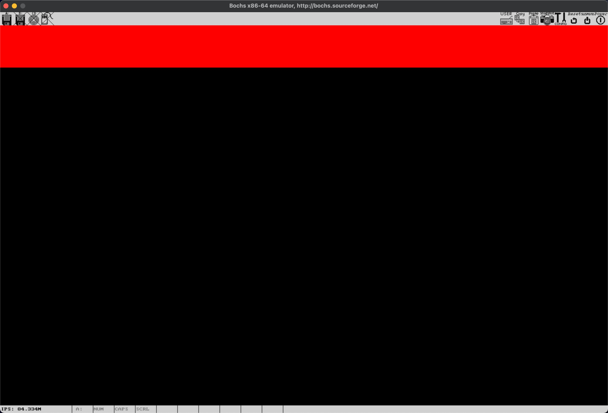

# Kernel display and font lib

从这一节开始，我们仿照 C 中的 print 家族函数，为内核开发一套类似的日志打印接口。这个过程大致分成三个阶段：

* 第一阶段：我们需要了解新的 frame buffer 的写入方式；
* 第二阶段：基于像素构建一套最简单的 ASCII 字库。在图形模式下，我们无法再直接使用 BIOS 中断显示字符，说的更直接一点，对于我们的内核来说，就连字母长什么样子，都需要自己基于像素定义；
* 第三阶段：实现一套和 C 类似的 print 家族函数；

这一节，我们先来完成第一阶段。

## 0x180 工作模式下的 frame buffer

还记得之前在字符模式下我们是如何写入 frame buffer 的么？每显示一个字符，我们需要两个字节。低字节是要显示的字符的 ASCII 码，高字节是显示的属性，其中，前景色，背景色，高亮等属性，都被压缩在高字节里。这也就导致了字符模式下，显示的内容和效果，都是非常有限的。

那我们在 loader 中为内核设置的 0x180 这种显示模式又如何呢？详细的信息可以参考之前我们说过的 VBE 控制器信息的查询方式来读取，这里我们就不再重复了，只说几个重要的部分：

* 首先，这种模式的 frame buffer 物理地址是 0xE0000000，上一节为内核设置页表的时候我们也提到过了；
* 其次，这种模式的分辨率是 1440 x 900；
* 第三，这是一种 32 位真彩色的工作模式，也就是说，每显示一个像素，我们都需要 4 个字节来指定这个像素的颜色属性。这四个字节从低到高，分别表示蓝色、绿色和红色的属性，最高字节是保留位，要设置成0。因此，在这种工作模式下，每个像素可以呈现的颜色，都是 2^24，也就是 1670 万种色彩；

如果你曾经自己写过字符模式下写屏的代码，现在一定会觉得，有了上面这两个重要信息，我们不就已经可以动手来绘制屏幕了么？没错，接下来，在 main.c 的 `Start_Kernel` 方法里，我们就直接“画”点东西来体验下图形模式的写屏操作。

首先，定义一个辅助函数 `pixel_fill32`：

```c
void pixel_fill32(unsigned int * fb,
  unsigned int rgb, int x0, int y0, int x1, int y1) {
  int x = 0, y = 0;
  rgb = rgb & 0x00FFFFFF;

  for (y = y0; y < y1; ++y) {
    for (x = x0; x < x1; ++x) {
      int offset = 1440 * y + x;
      fb[offset] = rgb;
    }
  }
}
```

其中：

* `fb` 表示要写入的 frame buffer 的地址；
* `rgb` 表示填充的颜色，它的格式是这样的：

```shell
 31 ──────────24─┬ 23 ────────16 ┬ 15 ──────── 8 ┐7 ──────────── 0
 │      0        │      Red      │     Green     │     Blue      │
 └───────────────┴───────────────┴───────────────┴───────────────┘
```

* `x0, y0` 表示绘制的起点；
* `x1, y1` 表示绘制的终点；

这里，`(x0, y0)` 和 `(x1, y1)` 的坐标系，都是以屏幕左上角为原点，x 轴向右，y 轴向下为正的。`pixel_fill32` 的作用，就是把由这两个点确定的区域，填充上 `rgb` 指定的颜色。

在它的实现里，外层的 `for` 循环控制着每一行的显示，内层的 `for` 循环控制着行内每一列，也就是每一个像素的显示。这个算法最重要的，就是计算出每一个像素在 frame buffer 里的偏移。就像下面这张图表示的一样，`(x0, y0)` 在 frame buffer 里，应该是第 `y0 * 1440 + x0` 个要显示的像素：

```shell
(0,0) ──────────────────────────────────────────Screen ┐
  │                                                    │
  ├────────────────────────────────────────────────────┤
  │                                                    │
  ├───────────────. (x0,y0) ────.──────────────────────┤
  │              (y0 * 1440 + x0)                      │
  ├───────────────`─────────────'──────────────────────┤
  │                                                    │
  └────────────────────────────────────────────────────┘
```

计算出这个位置之后，我们就可以用它作为偏移，写入 `rgb` 表示的颜色，对应位置的像素，就可以显示出来了。

完成后，在 `Start_Kernel` 里，我们用下面的代码来试下：

```c
void Start_Kernel() {
  unsigned int *fb = (unsigned int *)0xFFFF800000A00000;
  pixel_fill32(fb, 0x00FF0000, 0, 0, 1440, 100);
}
```

`0xFFFF800000A00000` 是 frame buffer 的起始地址在内核中的线性地址，这个在为内核设置页表的时候我们说过了。这样，我们就从屏幕左上角位置，画了一条高度是 100 像素的红色色带。执行 `make && make image` 之后，在 bochs 里执行，应该就可以看到这样的结果了：



## What's next

现在，我们终于又能在屏幕上显示内容了。既然能画出矩形，理论上，我们就可以画出任意的图形。是不是一下子觉得 GUI 都离我们不太远了？不过，先别着急。相比绘制窗口，更重要的事情，是能够在屏幕上显示文字。就像一开始说的，在图形模式下，文字也是由像素组合出来的。因此，下一节，我们来给内核定义一套最简单的字库，并在屏幕上，显示图形模式下的第一个字符。
