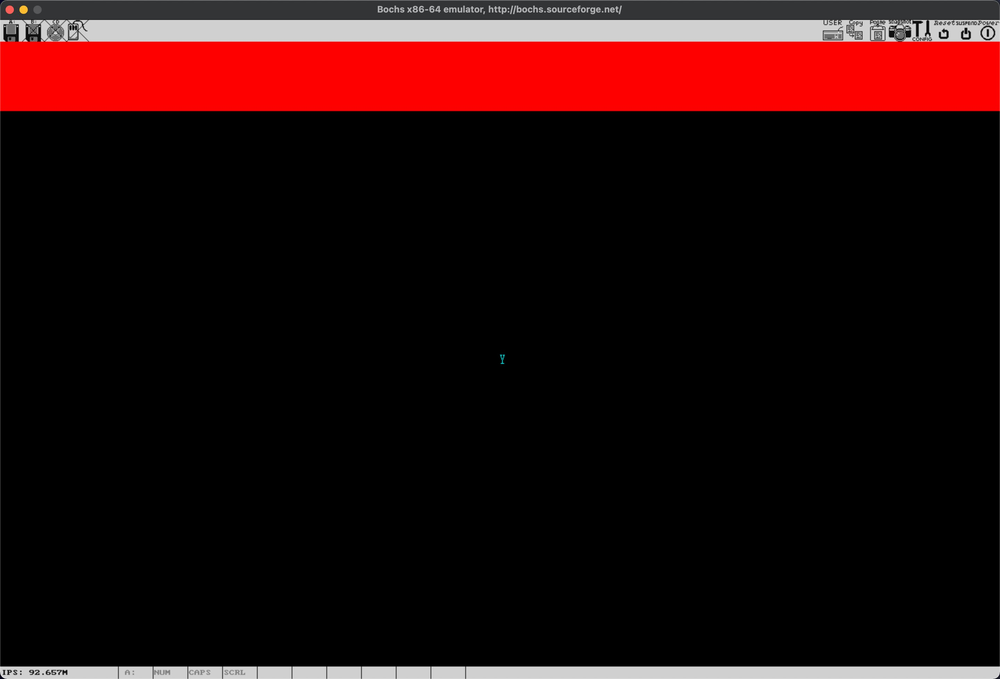

# Craft a font lib

在图形模式下，显示的任何内容，都是像素的堆叠，文字当然也不例外。因此，为了在图形模式下显示文本，我们要做的第一件事，就是开发一套字库。

所谓字库，可以理解为是一套要显示文字的绘制指南。在“一个字体大小”的区域里，定义好哪些位置要显示前景色，哪些位置要显示背景色。然后，在 frame buffer 里，根据这份“指南”绘制每一个像素，对应的文字，就可以显示在屏幕上了。

## 设计字库

我们的字库，每个字符 8 像素宽，16 像素高。因此，一个字符需要用 128 像素来表达，把这 128 个像素当成一个位图，我们可以定义一个 16 字节的数字来表达。例如，字符 `!` 的定义是这样的：

```c
unsigned char font_ascii[256][16]=
{
  ...
  {0x00,0x10,0x10,0x10,0x10,0x10,0x10,0x10,0x10,0x10,0x00,0x00,0x10,0x10,0x00,0x00}, //33 '!'
  ...
};
```

`font_ascii` 就是我们的字库，它的索引，是字符的 ASCII 值。数组中的每一个元素的每一个 bit，表示对应行像素的显示方法。例如，把表示字符 `!` 的元素用二进制表达，就是这样的：

```shell
0 0 0 0 0 0 0 0
0 0 0 1 0 0 0 0
0 0 0 1 0 0 0 0
0 0 0 1 0 0 0 0
0 0 0 1 0 0 0 0
0 0 0 1 0 0 0 0
0 0 0 1 0 0 0 0
0 0 0 1 0 0 0 0
0 0 0 1 0 0 0 0
0 0 0 1 0 0 0 0
0 0 0 1 0 0 0 0
0 0 0 0 0 0 0 0
0 0 0 0 0 0 0 0
0 0 0 1 0 0 0 0
0 0 0 1 0 0 0 0
0 0 0 0 0 0 0 0
0 0 0 0 0 0 0 0

```

其中，1 的部分对应的像素，我们用前景色绘制；0 的部分对应的像素，我们用背景色绘制，屏幕上就是一个类似 `!` 的文字了。我们就是用这种方式，定义了每一个 ASCII 字符在这个 16x8 的区域里的绘制方法。理解这个思路并不难，但要都写出来可真的是一个体力活。因此，理解了这个想法之后，直接使用 [font.h](https://github.com/puretears/yuna/blob/master/Source/Kernel/font.h) 中的代码就好了。当然，你也可以仿照这个方法，继续扩充内核可以显示的文字。

## 把文字打印在屏幕上

有了字库之后，接下来，就该把它们实际显示在屏幕上了。和内核打印相关的代码，都在 [printk.h](https://github.com/puretears/yuna/blob/master/Source/Kernel/printk.h) 和 [printk.c](https://github.com/puretears/yuna/blob/master/Source/Kernel/printk.c) 这两个文件里。其中，直接写 frame buffer 的，是 `putchar` 函数。先来看它的声明：

```c
void putchar(unsigned int *fb,
  int scn_width,
  int x, int y,
  int fg_color, int bg_color, unsigned char c);
```

其中：

* `fb` 是 frame buffer 的地址；
* `scn_width` 是屏幕的像素宽度，我们需要这个值计算一行能显示多少个字符；
* `x, y` 是要显示的文字的坐标；
* `fg_color` 和 `bg_color` 是 RGB 格式的前景和背景色；
* `c` 是要显示的字符；

然后，是它的实现：

```c
void putchar(unsigned int *fb,
  int scn_width,
  int x, int y,
  int fg_color, int bg_color, unsigned char c) {
  int row_per_char = 0, column_per_char = 0;
  int fg_test = 0;
  unsigned int *fb_addr = NULL;
  unsigned char *font_pixel = font_ascii[c];
  // ...
}
```

一开始，我们定义了一些会用到的变量，其中：

* `row_per_char` 和 `column_per_char` 表示字库中每个字符占用的行数和列数；
* `fg_test` 用于测试当前像素是应该显示前景色还是背景色；
* `fb_addr` 是在 frame buffer 中移动的指针，我们通过它实现写屏；
* `font_pixel` 是根据 `c` 从字库中读取的绘制指南；

接下来，和上段视频绘制矩形的方式类似，我们也用一个双层 `for` 循环来显示字符：

```c
for (; row_per_char < 16; ++row_per_char) {
  fb_addr = fb + scn_width * (y + row_per_char) + x;
  fg_test = 0x100;

  for (column_per_char = 0; column_per_char < 8; ++column_per_char) {
    fg_test = fg_test >> 1;

    if (*font_pixel & fg_test) {
      *fb_addr = fg_color;
    }
    else {
      *fb_addr = bg_color;
    }

    ++fb_addr;
  }

  ++font_pixel;
}
```

其中，外层 `for` 循环控制每一行的显示。我们先根据 `(x, y)` 的值计算出这一行数据在 frame buffer 中的起始地址。并让 `fg_test` 初始值是 `0x100`，这样，它的低 8 位就可以用于测试这一行上每一个像素应该显示前景色，还是背景色了。

然后，在内层循环里，我们显示一行中的 8 个像素（因为我们的字符是 8 个像素宽）。每显示一个像素，就让 `fg_test` 向右移动一位，如果 `*font_pixel & fg_test` 的值为 1，就说明“蓝图”中要求这个位置显示前景色，否则，就应该显示背景色。我们把对应的颜色写入 `fb_addr`，并让它移动到 frame buffer 的下一个位置。

每当显示完一行，我们就把 `font_pixel` 递增，让它指向字符 `c` 的下一行显示“蓝图”，直到 16 行都绘制完，`c` 就应该显示在屏幕上了。

## 测试显示效果

现在终于到了检验结果的时候了。接着我们上一节完成的代码，在 `pixel_fill32` 后面，添加 `putchar` 的调用：

```c
void Start_Kernel() {
  unsigned int *fb = (unsigned int *)0xFFFF800000A00000;
  pixel_fill32(fb, 0x00FF0000, 0, 0, 1440, 100);

  putchar(fb, 1440, 720, 450, 0x0000FFFF, 0x00000000, 'Y');
}
```

这里：

* `(720, 450)` 是屏幕中心位置的坐标；
* `0x0000FFFF` 是前景色，也就是绿色；
* `0x00000000` 是背景色，也就是黑色；
* `Y` 是要显示的字符；

执行 `make && make image` 编译安装。完成后，执行 bochs，如果一切顺利，就可以看到下面这张图了：



## What's next

至此，我们终于又可以在屏幕上显示文字了。对于我们来说，这绝对是一个重大的突破。但 `putchar` 实际用起来，不免有些过于繁琐，我们暴露了太多和显示设备相关的信息。而且，在信息格式化方面，`putchar` 几乎没有任何支持。因此，它只适合当做一个底层的辅助函数，并不适合作为显示信息的 API。我们这里用它，只是为了快速验证一下整个系统是否可以正常工作。

从下一节开始，我们就基于 `putchar`，实现一套和 C 的 `print` 家族函数几乎一样的打印 API。
