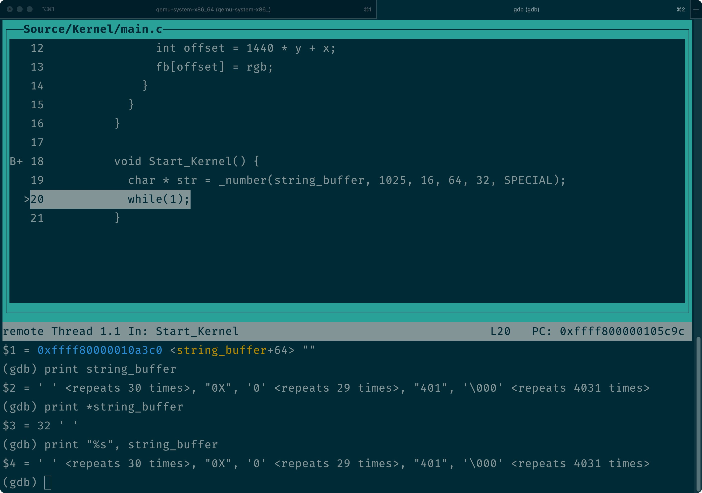

# The print family iii

这一节，我们来实现格式化字符串的函数 `vsprintf`。

## _number

由于这个函数比较复杂，在开始实现它的逻辑之前，我们要先做一些准备。首先，是处理各种数字显示逻辑的 `_number`。

### _number 的声明

这个函数最主要的工作之一，就是把数字格式化成各种形式。为此，我们要先来实现一个辅助函数：`_number`，它的签名是这样的：

```c
char *_number(char *str, long num, int base, int width, int precision, int type)
```

其中：

* `str` 表示存储格式化后结果的缓冲区；
* `num` 表示要格式化的十进制数字；
* `base` 表示要转换的数制，理论上，`_number` 支持 2 至 36 进制数的格式化，不过我们常用的也就是 2 进制和 16 进制；
* `width` 表示格式化后字符串的宽度，如果结果小于这个宽度，会在左边补充空格；
* `precision` 对于整数来说，这个值表示格式化后整个数字的宽度，如果结果小于这个值，会在左边补 0；

> 例如，对于二进制数字 1011 来说，如果 `width` 是 8，`precision` 是 6，生成的字符串就是 `  001011`。

* `type` 表示附加在格式化结果上的选项，这些选项定义在 printk.h 里。对于 `_number` 来说，用到的有下面几个：

```c
#define PLUS    1 << 1
#define SPACE   1 << 2
#define SPECIAL 1 << 3
#define LOWERCASE 1 << 4
#define SIGN    1 << 5
```

至于它们各自的作用，我们说到实现的时候再详细解释。

### _number 的实现

接下来，我们就从头来看 `_number` 的实现过程：

```c
char *_number(char *str, long num, int base, int width, int precision, int type) {
  if (base < 2 || base > 36) { return 0; }

  const char *digits = "0123456789ABCDEFGHIJKLMNOPQRSTUVWXYZ";
  if (type & LOWERCASE) {
    digits = "0123456789abcdefghijklmnopqrstuvwxyz";
  }

  // ...
}
```

首先，我们判断了 `base`，如果不在支持的数制转换范围里，就返回 0。这里之所以最大值是 36，是因为我们用于显示数字的字符，最多就到字母 Z。

其次，是 `type` 支持的第一个选项，`LOWERCASE` 表示用小写字母表达转换结果。如果置位，我们就把 `digits` 中的字符都换成小写，稍后，我们会从这里读取和数字对应的字符；

接下来，是 `_number` 支持的其它选项的处理：

```c
char *_number(char *str, long num, int base, int width, int precision, int type) {
  // ...

  /* Set sign */
  char sign = 0;
  if ((type & SIGN) && num < 0) {
    sign = '-';
    num = -num;
  }
  else if (type & PLUS) {
    sign = '+';
  }
  else if (type & SPACE) {
    sign = ' ';
  }
  if (sign) { width -= 1; }

  if (type & SPECIAL) {
    if (base == 16) { width -= 2; } // 0x prefix
    else if (base == 8) { width -= 1; } // o prefix
  }
  
  // ...
}
```

其中：

* `SIGN / PLUS` 表示当 `num` 为负数和正数时，在数字前面分别显示 `-` 和 `+`；
* 当 `num` 为负数时，如果我们用 `SIGN` 处理了符号，就把 `num` 变成正数，这样读出来的负数中的每一位数字才正确。否则，我们的处理逻辑就是把 `num` 当成无符号数字处理；
* `SPACE` 表示在数字的符号位显示一个空格；
* `SPECIAL` 表示是否显示 8 进制或 16 进制的前缀；

只要我们使用了 `SIGN / PLUS / SPACE` 这三个选项中的任意一个，就要把 `width` 减 1，因为我们已经使用了一个符号位。同理，如果使用了 8 进制或 16 进制前缀，还要把 `width` 对应减 1 或 减 2。

处理完选项，我们就要对 `num` 进行数制转换了。计算的方法很简单，我们只要用 `num % base` 的值作为索引，在 `digits` 中取出对应的 ASCII 字符保存到 `tmp` 指向的临时缓冲区就好了：

> 这里有一个额外的注意事项，由于 `num` 是带符号的，在计算数组索引，以及计算下一个 `num` 值的时候，要把它转换成无符号长整形，否则计算出的结果是不正确的。

```c
char *_number(char *str, long num, int base, int width, int precision, int type) {
  // ...

  /* Calculate `num` in `base` and save each digit in `tmp` in reverse order. */
  int i = 0;
  char tmp[64];
  if (num == 0) { tmp[i++] = '0'; }
  else {
    while (num != 0) {
      tmp[i++] = digits[(unsigned long)num % base];
      num = (unsigned long)num / base;
    }
  }
}
```

这部分代码执行完后，`i` 的值就是转换后数字的位数。我们根据这个位数、`width` 和 `precision` 的值，给 `str` 指向的缓冲区填充必要的空格和 0：

```c
char *_number(char *str, long num, int base, int width, int precision, int type) {
  // ...
  /**
   * For integer specifiers, `precision` specifies the minimun number of digits to be written.
   * The value is not truncated even if the result is longer.
   * */
  if (i > precision) { precision = i; }
  
  /**
   * Minimum number of characters to be printed. If the value to be printed is shorter
   * than this number, the result is padding with blank spaces.
   */
  width -= precision;
  if (!(type & LEFT)) {
    while (width-- > 0) { *str++ = ' '; }
  }
}
```

可以看到，`precision` 实际上只是一个“建议值”，当要显示的字符数超过它时，会以实际要显示的字符数为准。当 `width` 减去 `precision` 有剩余，并且字符串不是左对齐的情况下，我们就给 `str` 指向的缓冲区填充空格。

接下来，是数字前缀部分的处理：

```c
char *_number(char *str, long num, int base, int width, int precision, int type) {
  // ...

  if (sign) { *str++ = sign; }

  if (type & SPECIAL) {
    if (base == 8) { *str++ = '0'; }
    else if (base == 16) {
      *str++ = '0';
      *str++ = digits[33]; // 0X or 0x
    }
  }

  while (i < precision--) {
    *str++ = '0';
  }
}
```

我们先向缓冲区写入 `sign` 指定的前缀字符，再写入数制的特定前缀。最后，如果 `precision` 的位数大于要显示的实际字符数，我们就在缓冲区中补 0。做好了这些处理之后，就是把之前存储在 `tmp` 中的数字写入 `str` 了：

```c
char *_number(char *str, long num, int base, int width, int precision, int type) {
  // ...
  while (i-- > 0) {
    *str++ = tmp[i];
  }

  while (width-- > 0) {
    *str++ = ' ';
  }

  return str;
}
```

最后，如果字符串采用的是左对齐，那么如果 `width` 中还有剩余空间，我们要在数字的后面补充空格。所有这一切都完成之后，返回 `str` 供接下来的打印方法继续处理就好了。至此，这个 `_number` 就实现完了，完整的代码，在 [printk.c](https://github.com/puretears/yuna/blob/master/Source/Kernel/printk.c) 里，大家可以自己去 GitHub 上看下。继续之前，我们先在 `Start_Kernel` 中试一下：

```c
void Start_Kernel() {
  char * str = _number(string_buffer, 1025, 16, 64, 32, SPECIAL);
  while(1);
}
```

这里，`string_buffer` 是之前定义在 `print.h` 中的全局字符串缓冲区。我们要把 1025 转换成 16 进制显示。宽度是 64，数值部分的宽度是 32，并且显示 `0X` 前缀。用之前说过的方法在 `Start_Kernel` 打个断点，当执行到 `while(1)` 的时候，观察 `string_buffer` 的值，结果应该是类似这样的：



把它拼凑起来，就是 30 个空格，加上 `0x`，加上 29 个 0，加上 401（这是 1025 的十六进制）。和我们的预期是相同的，这表示 `_number` 已经可以正常工作了。

## What's next

有了这个数值转换的函数之后，下一节，我们来看如何在 `vsprintf` 中处理格式化字符串时支持的各种选项。
