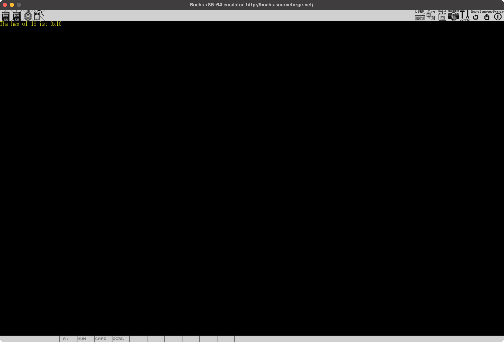

# The print family v

这一节，我们完成内核打印函数家族的最后一个成员，`vsprintf`。有了之前的各种准备工作，它实现起来就相对容易一些了。先来看它的声明：

```c
int vsprintf(char *buf, const char *fmt, va_list args)
```

其中：

* `buf` 是 `vsprintf` 写入的字符串缓冲区；
* `fmt` 是生成字符串的内容模板；
* `args` 是基于 `fmt` 的剩余参数；

然后，来看 `vsprintf` 的整体实现逻辑：

```c
int vsprintf(char *buf, const char *fmt, va_list args) {
  char *str;
  int flags;
  int width;
  int precision;
  int sub_specifier;

  for (str = buf; *fmt; ++fmt) {
    // ...
  }

  *str = '\0';
  return str - buf;
}
```

我们定义了一些临时变量用于缓存每个格式描述符中使用的标记。然后，用一个 `for` 循环遍历 `fmt` 指向的内容模板，并进行相应的处理。当这个遍历结束之后，根据 C 中字符串的约束，在结尾添加一个 `\0` 字符。这样：

* `buf` 指向的就是最终格式化之后的字符串；
* `str - buf` 就是字符串的长度，也是 `vsprintf` 的返回值，这和 C 函数库中的 `vsprintf` 是一样的；

因此，我们接下来的重点，就是来看看 `for` 循环中究竟发生了什么。因此，为了格式上简单一些，代码部分，我就不在列出 `vsprintf` 外围的部分了。在 `for` 循环的一开始，我们处理最简单的情况，即模版中的内容，就是要显示的字符，我们直接把字符拷贝到 `str` 就好了：

```c
for (str = buf; *fmt; ++fmt) {
  // Normal characters
  if (*fmt != '%') {
    *str = *fmt;
    ++str;
    continue;
  }
}
```

否则，说明我们遍历到了 `%`，就用上一节定义的四个辅助方法处理标识符的不同部分：

```c
for (str = buf; *fmt; ++fmt) {
  // ...

  // %[flags][width][.precision][length]specifier
  // Parse flags
  ++fmt;
  flags = _parse_flags(&fmt);

  // Parse width
  width = _parse_width(&fmt);

  // Parse precision
  precision = _parse_precision(&fmt);

  // Parse sub specifier
  sub_specifier = _parse_sub_specifier(&fmt);
}
```

在这四个辅助方法的内部，我们都会直接或者间接的移动 `fmt`，因此，这段代码执行之后，不仅 `flags / width / precision / sub_scriber` 四个变量中已经保存了对应的选项，`fmt` 也指向了模板中下一个要处理的字符。这个字符就是格式标识符中的最后一部分，也就是指定数据的类型，数字的数制等信息的部分。按照 C 函数库支持的选项，我们一个个来看。

## 显示单个字符

第一个是显示单个字符的 `c` 选项。这部分我们要做的，就是从可变参数列表中读取 ASCII 值存到 `str` 指向的缓冲区，并根据 `width` 和对齐方式填充空格。

```c
for (str = buf; *fmt; ++fmt) {
  // ...
  // Parse specifier
  char *s;
  int str_len, i;
  switch (*fmt) {
    case 'c': // Character
      if (!(flags & LEFT)) {
        while (--width > 0) { *str++ = ' '; }
      }

      *str++ = (unsigned char)va_arg(args, int);

      while (--width > 0) { *str++ = ' '; }
      break;
  }
}
```

## 显示字符串

第二个，是显示字符串的 `s` 选项：

```c
for (str = buf; *fmt; ++fmt) {
  // ...
  // Parse specifier
  char *s;
  int str_len, i;
  switch (*fmt) {
    // ...
    case 's': // String
      s = va_arg(args, char *);
      if (!s) { s = '\0'; }
      str_len = strlen(s);

      if (precision < 0) {
        precision = str_len;
      }
      else if (str_len > precision) {
        str_len = precision;
      }

      if (!(flags & LEFT)) {
        while (str_len < width--) {
          *str++ = ' ';
        }
      }

      for (i = 0; i < str_len; ++i) {
        *str++ = *s++;
      }

      while (str_len < width--) {
        *str++ = ' ';
      }
      break;
  }
}
```

这次，我们从可变参数列表读取的，应该是 `char *`。然后，用了一个叫做 `strlen` 的函数计算字符串的长度，这个函数定义在 [lib.h](https://github.com/puretears/yuna/blob/master/Source/Kernel/lib.h) 里，它的实现，我们先放放，先集中经历在格式标识符的处理上。

接下来，通过下面这几行代码，我们可以理解对于字符串类型来说，格式描述符中 `precision` 部分的含义：

```c
if (precision < 0) {
  precision = str_len;
}
else if (str_len > precision) {
  str_len = precision;
}
```

然后，我们只要遍历字符串，逐个写入 `str`，并根据 `width` 和对齐方式填充空格就好了。

## 显示各种形式的数字

第三个，是显示数字的一组选项：

* `o` 表示 8 进制显示；
* `p` 表示按指针地址显示；
* `x` 或 `X` 表示按 16 进制显示；
* `d` 和 `i` 表示按 10 进制有符号整数显示；
* `u` 表示按 10 进制无符号长整形显示；

之所以把这些选项放到一起，是因为它们的处理逻辑是完全一样的，都是利用了之前我们实现过的 `_number` 函数，只是传递给 `_number` 的参数不同罢了：

```c
for (str = buf; *fmt; ++fmt) {
  // ...
  // Parse specifier
  char *s;
  int str_len, i;
  switch (*fmt) {
    // ...
    case 'p': // Pointer address
      if (width == -1) {
        width = 2 * sizeof(void *);
      }

      str = _number(str, (unsigned long)va_arg(args, void *), 16, width, precision, flags);
      break;
    case 'x':
      flags |= LOWERCASE;
    case 'X': // Hexidecimal
      if (sub_specifier == 'l') {
        str = _number(str, va_arg(args, unsigned long), 16, width, precision, flags);
      }
      else {
        str = _number(str, va_arg(args, unsigned int), 16, width, precision, flags);
      }
      break;
  }
}
```

这里，简单起见，我们只列出了打印指针和 16 进制数字的处理方法，大家可以对着传递给 `_number` 的参数理解下这些选项和之前解析的各种标志是如何搭配在一起工作的，完整的实现，大家可以参考 GitHub 上的 [printk.c](https://github.com/puretears/yuna/blob/master/Source/Kernel/printk.c)。

## 显示百分号

第四，是显示百分号自身的 `%`：

```c
for (str = buf; *fmt; ++fmt) {
  // ...
  // Parse specifier
  char *s;
  int str_len, i;
  switch (*fmt) {
    // ...
    case '%':
      *str++ = '%';
      break;
  }
}
```

这部分很简单，直接向缓冲区写入 `%` 就好了。

## 默认情况的处理

最后，是默认情况的处理。我们的做法是只要 `fmt` 不为空，就“无脑”写入到缓冲区，否则，就把 `fmt` 回退到之前的位置并结束循环：

```c
for (str = buf; *fmt; ++fmt) {
  // ...
  // Parse specifier
  char *s;
  int str_len, i;
  switch (*fmt) {
    // ...
    default:
      if (*fmt) {
        *str++ = *fmt;
      }
      else {
        --fmt; //
      }
      break;
  }
}
```

## 验证结果

至此，`vsprintf` 就实现完了，是时候检查下结果了。在 `Start_Kernel` 里，输入下面的代码：

```c
void Start_Kernel() {
  pos.scn_width = 1440;
  pos.scn_height = 900;
  pos.char_x = 0;
  pos.char_y = 0;
  pos.char_width = 8;
  pos.char_height = 16;
  pos.fb_addr = (unsigned int *)0xFFFF800000A00000;
  pos.fb_length = pos.scn_width * pos.scn_height * 4;

  int number = 16;
  printk(YELLOW, BLACK, "The hex of %d is: %#x\n", number, number);
}
```

如果一切顺利，编译执行一下，就可以在 Bochs 看到下面的结果了：



## What's next

说到这，内核打印日志的函数库基本就完成了，有了这些 API，我们就又能在屏幕上显示内容了。可以在图形模式下显示内容，这绝对是内核开发中意义重大的一步。下一节开始，我们为内核实现中断和异常处理模块。
