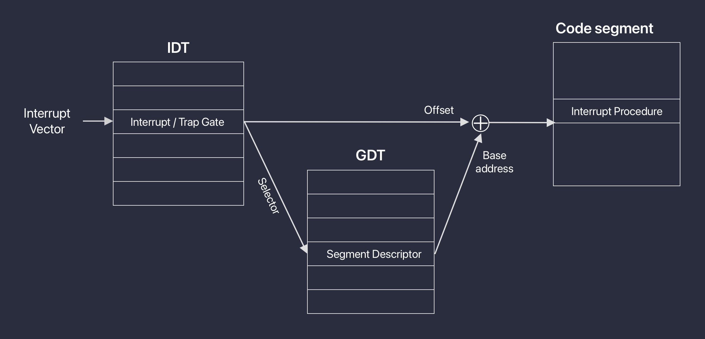
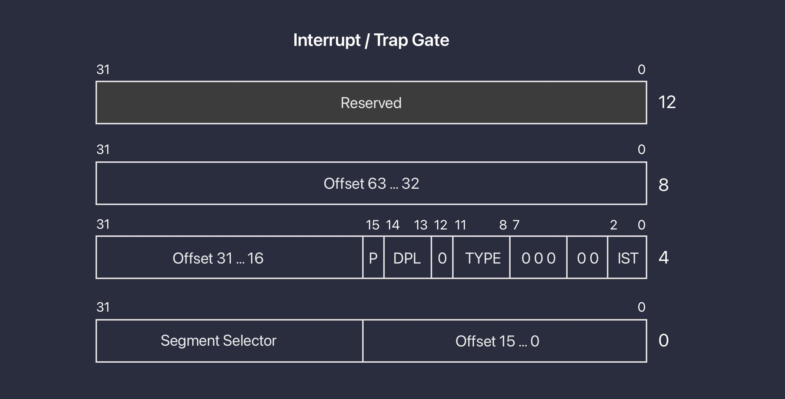
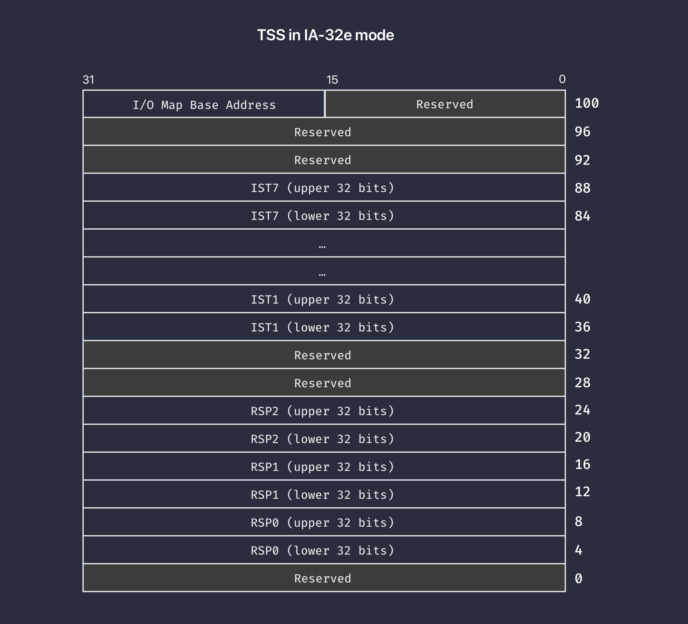

# Interrupt and exceptions basics

在这个系列里，我们给内核实现一个初步的中断和异常处理机制。为什么说是初步的呢？因为以后，我们还会利用 CPU 的 APIC 给内核实现更高级的中断管理机制。那为什么给内核实现了打印之后，选择了实现这部分内容呢？因为内核的调试，往往是比较麻烦的，能找到发生异常的代码并打印出来，可以帮助我们更好的排错，这对于继续实现其它内核组件，是非常有帮助的。

## CPU 层面的异常

内核都应该处理哪些异常呢？软件能够接触到的最底层的，就是 CPU 层面的异常了。按照 Intel 的文档，根据错误的严重程度，CPU 可能发生的异常分成三类：

* **Fault**：这是最普通的异常，只要异常被修复，CPU 仍旧可以恢复到发生异常的 CPU 指令继续执行；
* **Trap**：这是比 fault 严重一些的异常，CPU 会跳过发生 trap 异常的指令，从下一条指令继续执行；
* **Abort**：这是最严重的一类异常，CPU 无法提供产生异常的准确位置，也无法从错误中恢复执行，通常这类错误都来自于硬件错误；

在 Intel SDM 手册第三卷 6.3.1 小节里，可以找到 32 个 Intel 预定义的 CPU 异常，这里我们节选一些来看看：

| Vector | Mnemonic | Description | Type | Source |
| --- | --- | --- | --- | --- |
| 0 | #DE | Divide Error | Fault | DIV and IDIV instructions |
| 3 | #BP | Breakpoint | Trap | INT3 instruction |
| 8 | #DF | Double fault | Abort | Any instruction that can generate an exception |

其中：

* **Vector** 表示异常的向量编号，稍后就会看到，我们需要使用这个编号查找对应的异常处理程序。编号 0 - 31 是 Intel 预定义的，32 - 255 允许开发者自定义异常；
* **Mnemonic** 表示异常的助记符，Intel 的 SDM 里大量使用了它们表达对应的异常，在接下来的内容里，我们也会用到；
* **Description** 是异常的描述；
* **Type** 就是我们刚说过的异常类型，这里，我特意每种异常都挑了一个例子；
* **Source** 是异常可能的发生源头，暂时我们还不需要关注它们；

## 64 位模式下 CPU 的异常处理

了解了异常的类型之后，接下来的问题就是：CPU 是如何处理它们的呢？从发生异常代码的位置“跳转”到异常处理程序的这个过程，需要若干数据结构的参与，把它们用一张图描述是这样的：

首先，用向量编号在 IDT 中查找对应的表项，这里的表项叫做**门描述符**。IDT 中有两类门描述符，分别是对应中断的**中断门描述符**和对应异常的**陷阱门描述符**。它们的细节我们现无需关心，只要知道门描述符里提供了两个信息：分别是异常或中断处理程序所在的代码段的 Selector 和偏移。

这样，我们就可以用 Selector 在 GDT 中读取到代码段的基地址，再加上门描述符提供的偏移，就可以跳转到对应的处理程序了。

### IA-32e 模式的门描述符

接下来，我们就具体来看看 IA-32e 模式下，门描述符具体的格式：

每一个门描述符都是一个 16 字节的数据结构，其中：

* Segment Selector 用于在 GDT 中，获取中断或异常处理程序所在的代码段。由于我们采用了扁平模式的寻址方式，所有中断或异常处理程序代码段的基地址都是 0。因此，这个 Selector 的作用并不大；
* 三段 Offset 的部分拼起来，是中断或异常处理程序代码的偏移，在扁平模式下，也就是要跳转到的目标地址；
* IST：这是移动到中断或异常处理程序时，保存上下文环境使用的栈指针。因为我们还有可能要从中断或异常恢复执行，所以在跳转之前，要保存 CPU 的状态，现在大家知道有这么件事儿就好。IST 的具体用法，我们写代码的时候再详细说；
* TYPE：这是门描述符的类型，在 Intel SDM 第三卷 3.5 小节里，大家可以找到所有的门描述符类型，稍后，我们会用到其中一部分；

### IA-32e 模式的任务状态段描述符

现在，说过了 IDT 以及门描述符，是不是就能亲手试一下 CPU 异常处理了呢？emm... 别着急，我们还差一个非常关键的环节。开始执行异常处理程序之前，我们需要保存发生异常时的上下文环境，以便可以在处理完异常之后回到原来的地方继续执行。于是，这就产生了两个问题：

* 上下文环境都包括哪些内容呢？
* 该把上下文环境保存在哪儿呢？

对于第一个问题，我们约定上下文环境包括 CPU 的所有通用寄存器，RFLAGS 寄存器，CS 和 RIP 寄存器，以及发生异常时的 RSP 寄存器。

对于第二个问题，我们把这些信息存放在内核的栈里，至于栈里的具体位置，则是通过一个叫做任务状态段（TSS）的结构中获取的。在 IA-32e 模式下，TSS 的结构是这样的：

这里，我们先把 I/O base map 放一边，暂时用不到这部分内容。至于剩下的两部分：

* **RSP(0/1/2)**：表示 CPU 在不同优先级上使用的栈指针，这个等我们实现用户权限程序的时候会用到；
* **IST(1/2/3/4/5/6/7)**：用于存放 7 个栈指针值，当发生中断或异常时，CPU 会根据门描述符中的 IST 到这里取出对应的栈指针，并把上下文环境保存在栈里；

那 CPU 又是如何感知到 TSS 存在的呢？和 `gdtr` 与 `idtr` 类似，CPU 还有一个任务状态段寄存器，叫做 `tr`。CPU 通过这个寄存器访问 TSS。下一节写代码的时候就会看到，它的加载方式和加载 GDT 以及 IDT 也是类似的。

> 如果之前你有过 32 位保护模式的编程经验，就会发现异常和中断处理部分，32 位和 64 位的工作机制完全不同。在 32 位模式下，CPU 可以通过 TSS 自动保存上下文环境。但在 64 位模式，则需要开发者通过软件实现这个过程。下一节，通过代码实现的时候，我们还会提到这些差异中的细节。

## What's next

以上，就是这一节的内容。我们从理论上，了解了 CPU 中断和异常处理的工作流程。如果这是你第一次接触门描述符和 TSS，可能会觉得这些概念有点虚。下一节，我们就围绕着这套工作流程，来写代码。
