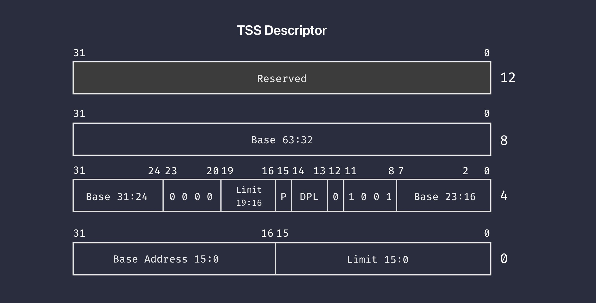

# Interrupt and exception init

理解了 CPU 在异常和中断处理的工作机制之后，这一节，我们来看对应的代码。

## IDT 和 TSS 的定义

首先，是 IDT 和 TSS 的定义，这部分在 head.S 里：

```asm
// IDT
.global idt
idt:
    .fill 512, 8, 0 // 256 x 16
idt_end:

idt_ptr:
    .word idt_end - idt - 1
    .quad idt

// TSS
.global tss
tss:
    .fill 13, 8, 0
tss_end:
```

在 IA-32e 模式下，由于每个 IDT 表项占 16 字节，最多支持 256 项，因此我们用 `.fill 512, 8, 0` 初始化了所有的项目。然后，用和之前定义 GDT 指针类似的方式，定义了 `idt_ptr`，它包含 IDT 的尺寸和起始地址。

而 TSS 则是 104 字节，我们也初始化成 0。但要注意的是，TSS 并没有类似的指针数据结构，稍后就会看到，TSS 的加载，是通过 GDT 中的表项完成的。

定义好这些结构之后，IDT 的加载，是在 head.S 中通过 `lidt idt_ptr(%rip)` 指令完成的，之前我们讲内核 head 部分的时候说过。至于加载 TSS，稍后等我们把 TSS 在内核中正式初始化之后，通过 C 函数来加载。

至此，在 head.S 里，我们总共用 `.global` 定义了三个符号，分别是：`gdt / idt / tss`。在接下来的 C 代码里，为了能访问到它们，我们在 [gate.h](https://github.com/puretears/yuna/blob/master/Source/Kernel/gate.h) 里，添加了下面的代码：

```c
extern descriptor gdt[];
extern gate_descriptor idt[];
extern unsigned int tss[26];
```

其中，`descriptor` 和 `gate_descriptor` 分别对应 GDT 和 IDT 表项的结构，其实就是两个 32 位无符号整数的组合：

```c
typedef struct {
  unsigned int low;
  unsigned int high;
} descriptor;

typedef struct {
  unsigned long low;
  unsigned long high;
} gate_descriptor;
```

而 `tss`，就是 26 个无符号整数的组合，我们就不再额外定义它的类型了。

## TSS 的初始化

接下来，在 `Start_Kernel` 里，初始化完 frame buffer 相关信息之后，我们要初始化的，就是 TSS 了：

```c
void Start_Kernel() {
  // ...

  tss_init();
  load_tr(8);
}
```

其中：

* `tss_init()` 用来设置 IA-32e 模式下 TSS 包含的具体值；
* `load_tr(8)` 则用于把设置到的 TSS 加载到 CPU；


它们具体是怎么工作的呢？我们从 `tss_init` 说起，它定义在 [trap.c](https://github.com/puretears/yuna/blob/master/Source/Kernel/trap.c) 里：

```c
void tss_init() {
  unsigned long stack = 0xFFFF800000007C00;
  set_tss64(stack, stack, stack, stack, stack, stack, stack, stack, stack, stack);

  set_tss64_desc(gdt + 8);
}
```

其中，`0xFFFF800000007C00` 是一个我们随意选择的内核栈地址。`set_tss64` 在我们引入的 `tss` 地址上，把所有可用的地址都写入 `stack` 的值：

```c
inline void set_tss64(
  unsigned long rsp0, unsigned long rsp1, unsigned long rsp2,
  unsigned long ist1, unsigned long ist2, unsigned long ist3,
  unsigned long ist4, unsigned long ist5, unsigned long ist6,
  unsigned long ist7) {
  *(unsigned long *)(tss + 1) = rsp0;
  *(unsigned long *)(tss + 3) = rsp1;
  *(unsigned long *)(tss + 5) = rsp2;

  *(unsigned long *)(tss + 9) = ist1;
  *(unsigned long *)(tss + 11) = ist2;
  *(unsigned long *)(tss + 13) = ist3;
  *(unsigned long *)(tss + 15) = ist4;
  *(unsigned long *)(tss + 17) = ist5;
  *(unsigned long *)(tss + 19) = ist6;
  *(unsigned long *)(tss + 21) = ist7;
}
```

因此我们暂时还不会用到特权级的切换，因此把栈指针都设置成一个值完全没问题。足够我们在初期观察它的工作方式了。设置好 `tss` 的值之后，我们要在 GDT 中为 TSS 设置一个专门的描述符。这是通过 `set_tss64_desc` 实现的：

```c
volatile void set_tss64_desc(descriptor *desc) {
  unsigned long high = 0;
  unsigned long low = 0;

  unsigned short limit = 103;
  unsigned short base15_to_0 = ((unsigned long)tss) & 0xFFFF;
  unsigned char base23_to_16 = (((unsigned long)tss) >> 16) & 0xFF;
  unsigned char attr = 0x89; // Present available TSS64
  unsigned char base31_to_24 = (((unsigned long)tss) >> 24) & 0xFF;

  desc->low = (base15_to_0 << 16) + limit;
  desc->high = (base31_to_24 << 24) + (attr << 8) + base23_to_16;

  ++desc;

  desc->low = ((unsigned long)tss) >> 32 & 0xFFFFFFFF;
  desc->high = 0;
}
```

在 IA-32e 模式下，TSS 的段描述符要占用两个表项。它的格式是这样的：



其中：

* 低 64 位的格式和 32 位模式下是类似的，`limit` 是 TSS 的长度减 1，线性地址我们按照格式把 `tss` 的地址拆开放入对应的部分；属性则是固定值 0x89，表示一个可用的 64 位 TSS；
* 高 64 位的部分，低 32 位表示 TSS 线性地址，高 32 位保留，

## 装载任务状态段寄存器

设置好 TSS 以及 TSS 的描述符之后，接下来就该装载 CPU 的任务状态段寄存器，也就是 `tr` 了。通过刚才的 `tss_init` 可以看到，我们把 TSS 的描述符设置在了 GDT 中的第 9 项：

```c
set_tss64_desc(gdt + 8);
```

那前 8 项都是什么呢？在 head.S 的注释中，我们标记了它们各自的用途：

```asm
.global gdt
gdt:
  .quad 0x0000000000000000 /* 0 - NULL descriptor */
  .quad 0x0020980000000000 /* 1 - Kernel 64-bit code segment */
  .quad 0x0000920000000000 /* 2 - Kernel 64-bit data segment */
  .quad 0x0020F80000000000 /* 3 - User 64-bit code segment */
  .quad 0x0000F20000000000 /* 4 - User 64-bit data segment */
  .quad 0x0000000000000000 /* 5 - Reserved for future use */
  .quad 0x0000000000000000 /* 6 - Reserved for future use */
  .quad 0x0000000000000000 /* 7 - Reserved for future use */
  .fill 10, 8, 0           /* 8,9 - TSS64 */
gdt_end:
```

其中，有些是预留给未来应用层程序的，有些是预留给未知用途的，大家先知道就好，我们等用到的时候再说。接下来，加载 `tr` 的工作，就是通过这一节开始我们看到的 `load_tr` 完成的：

```c
volatile void load_tr(unsigned char sel) {
  asm volatile(
    "ltr %%ax"
    :
    : "a"(sel << 3)
    : "memory"
  );
}
```

它接受一个参数，表示任务状态段描述符在 GDT 中的索引。按照 selector 的格式，我们把这个索引左移 3 位，存放到 `ax` 寄存器，并执行 `ltr` 指令。`tss` 表示的任务状态段，就加载到 CPU 了。

## What's next

说到这，设置并加载完 TSS 后，CPU 异常和中断处理的工作，我们就完成三分之一了。下一节，我们来构建第一个 CPU 异常处理程序，通过它了解如何在发生异常或中断时，保存 CPU 的上下文环境。
